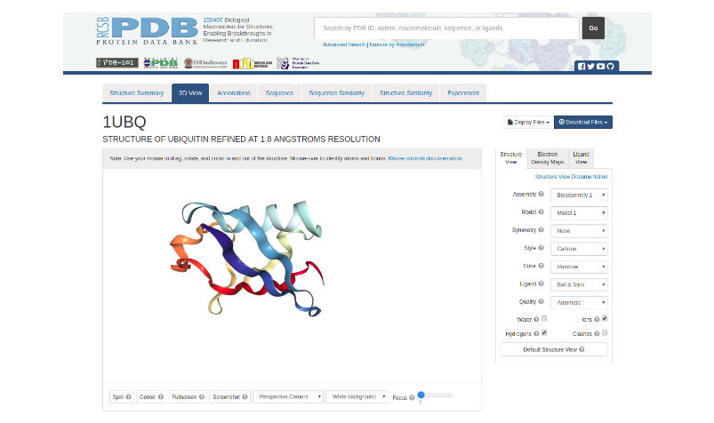
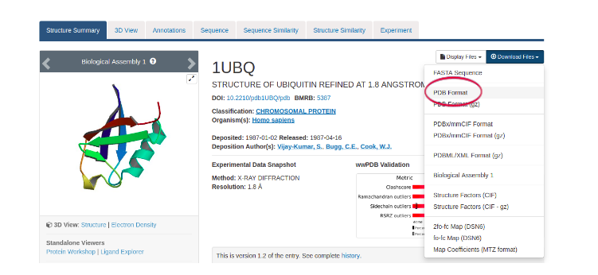

# La vida en tres dimensiones: introducción a la Bioinformática Estructural

##### Autora: Dra. Ana Julia Velez Rueda
>
> Material basado en el material de [Introducción a la Bioinformática de AJVeleRueda](https://github.com/AJVelezRueda/Introduccion_a_la_Bioinformatica)
>
> **LICENSE**: This work is licensed under a
[Creative Commons Attribution-ShareAlike 4.0 International License][cc-by-sa].
>
>[![CC BY-SA 4.0][cc-by-sa-image]][cc-by-sa]

[cc-by-sa]: http://creativecommons.org/licenses/by-sa/4.0/
[cc-by-sa-image]: https://licensebuttons.net/l/by-sa/4.0/88x31.png
[cc-by-sa-shield]: https://img.shields.io/badge/License-CC%20BY--SA%204.0-lightgrey.svg

## Origami molecular
La Bioinformática Estructural se centra principalmente en la exploración de la relación entre la estructura y la función de las macromoléculas biológicas y promueve el desarrollo de herramientas computacionales para dilucidar las bases estructurales de la función biológica. Al ser entidades dinámicas, la relación estructura-función en macromoléculas biológicas como las proteínas o los ácidos nucleicos, más concretamente se la formula como la relación estructura-dinámica-función. Es por ello que esta disciplina es clave en la comprensión de diversas temáticas que van desde el diseño recional de fármacos, hasta la regulación de expresión génica. Éste área de la bioinformática no sólo puede contribuir desde el punto de vista conceptual, incrementando nuestro conocimiento sobre las bases mecanísticas de algún sistema en particular, sino también la Bioinformática Estructural está íntimamente ligada a desarrollos Biotecnológicos, Farmacéuticos y Medicinales. 

Una aproximación a este gran mundo de la bioinformática estructural puede hacerse desde el estudio particular, pero amplísimo, de las proteínas.Y es desde allí que comenzaremos a explorar este mundo... 

## Un problema en tres dimensiones

Las proteínas son las unidades funcionales, estructurales y evolutivas de las células. Sabemos desde los primeros trabajos realizados por Anfinsen, que **existe una fuerte relación entre estructura y función**, es decir que la actividad biológica de una proteína depende de la disposición espacial de su cadena polipeptídica. Un gran número de proteínas requieren una determinada estructura terciaria (como llamamos a su estructura tridimensional) para cumplir con sus funciones biológicas. Se definen cuatro niveles distintos, conocidos como estructura primaria, secundaria, terciaria, y cuaternaria, y, cada uno de ellos se constituye a partir del anterior. 

Hoy en día sabemos que aunque las proteínas pueden adoptar una estructura definida, no están quietas y que existen muchos plegamientos posibles que explican su funcionalidad. En uno de los primeros trabajos que se estudiaba la relación entre la estructura y la función proteica, los autres Pauling y Mirsky definen el estado nativo de las proteı́nas como un plegamiento o conformación característico, que le confiere a las proteínas su función, y cuya pérdida denominaron desnaturalización (Mirsky y Pauling, 1936). 

En su superficie, las proteínas tienen forma de numerosas cavidades y protuberancias que crean microambientes únicos para la unión de ligandos o la catálisis. Y como las proteínas se mueven, las cavidades también tienen topologías dinámicas, con características que también podrán cambiar de una conformación a otra. La dinámica de estas cavidades es fundamental para comprender la función de las proteínas. 

Hoy en día sabemos que existen muchos plegamientos posibles que explican la funcionalidad de la proteína, es decir que el estado nativo no es único, si no que se describe actualmente como un conjunto de conformaciones en equilibrio dinámico. La distribución relativa de los distintos confórmeros puede variar por cambios en el entorno proteico (presencia de ligandos, fluctuaciones de pH, modificaciones postraduccionales, etc) (Kumar et al., 2000; Rueda et al., 2018). La magnitud de la diversidad conformacional observada en las proteínas puede abarcar desde la fluctuación en las cadenas laterales, hasta reordenamientos globales de la estructura terciaria (Böttcher et al., 2000; Koshland, 1998; Plapp, 2010). Aún pequeños cambios conformacionales generan diferencias en las estructuras proteicas (cavidades y túneles) que se describen en la estructura tridimensional teniendo efectos sobre su función. 

Pero por supuesto, conocer en qué consiste la estructura de una proteína de un modo computacional presenta ciertas complejidades. Existen en formas de representar la información tridimensional de una molécula en la computadora. Existen una multiplicidad de aplicaciones gratuitas que nos permita visualizar desde la estructura de una molécula pequeña, hasta una proteína, y que nos permiten además explorar las subestructuras proteicas más en profundidad. Vamos a comenzar con una exploración de una estructura tridimencional de una molécula sencilla:

>
> 🧗🏻‍♀️ Desafío I: Vamos a explorar como pasamos del plano, una secuencia o un dibujo a una estructura tridimensional. Abrí la herramienta [MolView](https://molview.org/) en tu navegador y mové la molécula que se previsualiza en la herramienta
>
> 🧗🏻‍♀️Desafío II: ahora tipeá `N-Butan` en el buscador a ver qué te dibuja la herramienta, probá lugo con el `1-butene` y `1-Butyne`, ¿qué diferencias ves entre estas moléculas en su disposición en el espacio? ¿Cómo te imaginás que debe almacenarse la información en una computadora para poder pasar del plano a algo tridimensional?
>

Como bien recordarás en geometría, un sistema de coordenadas es un sistema de referencia que utiliza números para determinar la posición de un objeto o punto en el espacio. Para almacenar información estructural de una molécula de un modo computacional, debemos echar mano de estos conocimientos básicos de geometría para posibilitarle a la computadora una forma sencilla de interpretar los datos de manera espacial.

Como habrás notado, cuando nos manejamos en el plano, en la pantalla de la izquierda de la herramienta, nos alcanzan dos coordenadas para describir la posición de cada espacio. Sin embargo, cuando pasamos a una figura tridimencional solo dos coordenadas nos complica la determinación de la ubicación del punto (o en este caso átomo) en el espacio; y se hace necesario pasar a un eje de 3 coordenadas. Existe en bioinformática un tipo de archivo muy común, que es el que conmunmente se utiliza para almacenar este tipo de información geométrica, que se conoce como archivo `PDB` y sobre el cuál muchas herramientas parten para realizar los distintos análisis estructurales que veremos a continuación.

Existen múchas formas de estudiar la relación entre la estructura y la función proteica y las implicancias de esta relación, por lo que en este apunte intentaremos resumir algunos aspectos básicos del análisis estructural.

¡Vamos a adentrarnos en la anatomía de las proteínas!

## Un problema estructural
Pero como mejor que decir es hacer, vamos a enfocarnos ahora en un sistema concreto para estudiar sus características estructurales. La ubiquitina (ubiquitin en inglés) es una proteína pequeña que ha sido encontrada en casi todas las células eucariotas (de allí viene su nombre: "ubiquo" significa omnipresente). Esta proteína es la encargada de la marcación química de las proteínas que ya no son necesarias, para que sean reconocidas y destruidas por otras proteínas. 

>**PARA PENSAR** 🤔:¿Por qué una célula querría destruir sus propias proteínas?

Descubramos un poco más acerca de la estructura terciaria de la ubiquitina. Para esto ingresemos al sitio web del Banco de Datos de Proteínas (Protein Data Bank, o PDB) (https://www.rcsb.org/). Esta página web corresponde a una de las bases de datos más utilizadas en la bioinformática, donde se encuentran almacenadas todas las estructuras de macromoléculas biológicas obtenidas hasta el momento. Las estructuras se almacenan en forma de archivos que contienen las coordenadas en el espacio, en ejes imaginarios X, Z e Y, de todos los átomos de una molécula dada. Estas coordenadas pueden ser interpretadas por algunos programas gráficos para mostrar de forma tridimensional cómo se vería, por ejemplo, una proteína en una célula o en una membrana.

En el cuadro de búsqueda de la PDB, ingresemos el código identificador de la ubiquitina humana: 1UBQ.

La página correspondiente a la 1UBQ contiene toda la información disponible sobre el experimento en el que se determinó la estructura terciaria de la ubiquitina humana. Incluye información adicional sobre la proteína extraída de otras bases de datos, que permiten conocer más sobre su secuencia, otras proteínas similares, etc. La primera pantalla que vemos es un resumen de la información estructural (Structure Summary).

>**PARA PENSAR** 🤔:¿Qué información nos provee esta página?
>
>**PARA PENSAR** 🤔:¿Cómo se determinó la estructura de esta proteína?
>
>**PARA PENSAR** 🤔:¿Representa esa imagen a la realidad del sistema biológico?
>
>**PARA PENSAR** 🤔:La estructura 1UBQ fue “refinada a una resolución de 1.8 Angstroms”. Éste es el error asociado al experimento: mientras mayor es la resolución, menor es la certeza al determinar la posición de cada átomo ¿Cuál es la utilidad y los condicionamientos de usar un modelo científico que sabemos inexacto?

Exploremos la pestaña de visualización tridimensional (3D View). Con el mouse podemos rotar, acercar y desplazar a la molécula. El menú de la derecha nos permite cambiar el modo de representación. 
En la pantalla principal vemos una representación de la estructura de ubiquitina. 

>**PARA PENSAR** 🤔: ¿Qué significan las cintas, las flechas y las regiones angostas?
>**PARA PENSAR** 🤔:¿Qué diferencias y similitudes notamos respecto de la representación inicial? 
>**PARA PENSAR** 🤔: En el menú de la izquierda hay opciones de distintos tipos de representación y formas de colorear la estructura tridimensional. ¿Para qué podría ser útil visualizar lo mismo de distintas maneras?

Volviendo a la página principal de la estructura, podemos usar el menú derecho para descargar un archivo (Download files) con las coordenadas espaciales de cada átomo de esta proteína. En el pequeño menú que se despliegue, elegiremos descargar la estructura de la proteína en formato PDB (PDB format), el estándar para estructuras de biomoléculas. 

>**PARA PENSAR** 🤔:¿Qué información esperaría encontrar como resultado un experimento destinado a determinar la estructura terciaria de una molécula biológica?

Podemos explorar el contenido del archivo que acabamos de descargar si lo observamos con un editor de texto. Haciendo clic con el botón derecho del mouse sobre el archivo descargado, usemos la opción Abrir con y seleccionemos el Bloc de Notas u otro editor de texto.

>**PARA PENSAR** 🤔: ¿En qué consiste un archivo PDB? 
>
>**PARA PENSAR** 🤔:Desplacémonos por el archivo hasta encontrar las líneas que comienzan con la palabra ATOM. ¿Qué tipo de información brinda esta sección?
>
>**PARA PENSAR** 🤔:¿Podríamos extraer de este archivo información sobre la estructura primaria de la proteína en cuestión? ¿Cómo se presenta dicha información y qué significa la representación? Desde el punto de vista computacional: ¿de qué tipo de dato se trata esta información?
>
>**PARA PENSAR** 🤔: ¿Considera que el formato PDB es útil para presentar los resultados del experimento?
>
>**PARA PENSAR** 🤔: Observamos que la información respeta cierta estructura interna. ¿Cuáles son los beneficios y las limitaciones de imponer una estructura para comunicar los resultados de un experimento? 
>
> Hemos visto que las proteínas tienen estructura tridimensional y hemos podido observar algunas características de las mismas. ¿Será igual con los ácidos nucléicos?
Rosalind Franklin es una científica muy relevante, que tuvo menos reconocimiento del merecido. Contanos sobre los procedimientos que puso Rosalind.

## Una solución en el bolsillo

El estudio estructural de proteínas nos proporciona múltiples campos de aplicación, por ejemplo uno de los más explorados en la actualidad es el diseño racional de fármacos. Si se conoce la base biológica de una enfermedad, es decir se conocen las moléculas implicadas, es posible diseñar medicamentos que interactúen con la molécula responsable, de tal forma que la modifique y se modifique el cuadro patológico. En otras palabras, el diseño racional de fármacos consiste en la aplicación del conocimiento biológico y estructural de los receptores (proteínas involucradas en una dada enfermedad) para diseñar moléculas que interactúen sólo con estos… dentro de lo posible!

Un caso de estudio interesante es el [EGFR](https://www.uniprot.org/uniprotkb/P00533/entry) es uno de los principales marcadores de cáncer de pulmón. Que presenta características diferenciales entre las conformaciones activas e inactivas que intentarremos explorar de forma computacional. 

Existen una gran variedad de softwares capaces de predecir la ubicación de estas subestructuras proteicas y sus propiedades. Y esta información combinada con la información evolutiva y secuencial, puede ser de gran utilidad para comprender la naturaleza de la función proteica. Toda esta información se encuentra combinada de una forma sencilla de visualizar y procesar en [CaviDB](https://cavidb.org). [CaviDB](https://cavidb.org),  una base de datos en línea gratuita que provee información sobre las cavidades proteicas y sus propiedades, que permite estudiar también la diversidad conformacional de las cavidades proteicas.  

Comencemos estudiando esta proteína, analizando las diferencias y similitudes de dos conformaciones activas e inactivas de la proteína:

        - La estructura 1M14 se corresponde con un confórmero activo: es decir, una estructura con actividad

        - La estructura 3W32 se corresponde con una conformación inactiva. 

> 
>🧗🏻‍♀️DESAFÍO III: Compará el sitio activo de ambos confórmeros (posición 837) así como también los tamaños de los pockets. ¿Qué observás?
> 
>🧗🏻‍♀️DESAFÍO IV: Investigá más sobre la proteína usando la base de datos [Uniprot](https://www.uniprot.org/) y anotá los sitios relevantes biológicamente
>
> 🧗🏻‍♀️DESAFÍO V:  ¿Coincide algún sitio de relavancia biológica con otras cavidades predichas en las conformaciones activa e inactiva?
> 
> 💡 Para investigar: Investigá en qué consiste el docking, en qué ideas basa su funcionamiento ¿Cómo podría aprovecharse este método para tratar el cancer?
>

## Sobre las huellas de la evolución

Las albúminas son las proteínas sanguíneas más abundantes en los mamíferos y tienen la propiedad principal de unirse y transportar muchos compuestos endógenos y exógenos, en su mayoría hidrofóbicos. La proteína es globular y está compuesta por tres dominios homólogos (I, II y III), cada uno de los cuales contiene dos subdominios similares (A y B). Las albúminas se conservan a lo largo de los vertebrados y los miembros de esta familia muestran una gran diversidad estructural a pesar de la conservación de la secuencia global. Es decir que, aún cuando su función biológica no es enzimática, se ha probado su capacidad catalítica para varias reacciones. Curiosamente, aunque todas las albúminas de mamíferos comparten la función principal de transporte de ligandos a través de la sangre, difieren en el tipo de reacciones que pueden catalizar. Además, la capacidad catalítica de las albúminas en solventes orgánicos las convierte en candidatas para económicas para manipulación biotecnológica para su aprovechamiento en procesos industriales.

En particular, la albúmina de suero humano (HSA) es la proteína principal en el plasma, se une a múltiples ligandos y recientemente se la ha descripto como un transportador de fármacos muy importante. Esta proteína monocatenaria tiene varios sitios de unión de fármacos y ácidos grasos, sin embargo, la mayoría de los fármacos se unen a los llamados Sitios I (Met 1 a Asn 111) y II (de Gln 196 a Pro 303). En particular, los residuos Lys 199, Arg 410, Tyr 411, Cys 34 y Lys 195 de HSA se describen como algunos de los más importantes, no solo para la unión de ligandos sino también para las actividades catalíticas descritas para esta proteína. 

Se sabe que la capacidade catalítica de una cavidad suele asociarse con algunas características estructurales de las mismas, como la presencia de aminoácidos activados (con pKas anormales) en ambientes mayoritariamente hidrofóbicos

> 🧗🏻‍♀️DESAFÍO VI: Investigá en [CaviDB](https://cavidb.org) las características estructurales de la Albúmina Humana sobre la estructura `1AO6A`:
>
> - ¿Cuántas cavidades fueron predichas para dicha estructura? ¿Cuáles son las pricipales cavidades en tanto a tamaño de la proteína? ¿Existen cavidades que se solapen con los residuos descritos como relavantes para la actividad enzimática de la albúmina?
>
> - ¿Alguna de las cavidades catalíticamente activas se encuentran activadas? ¿Qué rangos de pKa se observan en dichas cavidades? 
>
> 🧗🏻‍♀️DESAFÍO VII: Se sabe que en la albúmina bovina el sitio activo se encuentra corrido respecto del humano, aunque también involucra un aminoácido cargado (Lys 221). Investigá  en [CaviDB](https://cavidb.org) las características estructurales de la estructura de albúmina bovina `4JK4A` y compará las características de su sitio activo con las características del sitio activo de la albúmina humana (Lys 199)
>
> 💡 Para investigar: Leé más sobre los [hallazgos](https://www.sciencedirect.com/science/article/abs/pii/S0300908422000426) hechos por l@s investigadores/as de la Universidad Nacional de Quilmes sobre la evolución de albúminas y contrastalo con lo que pusidte observar.
>
