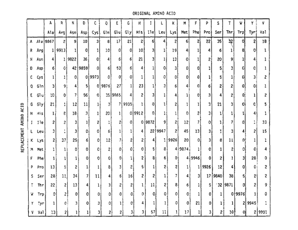
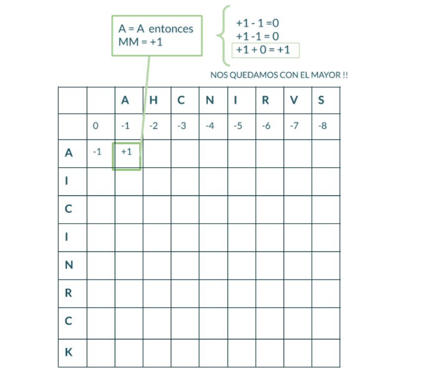

# Alinhamento de Sequências
> Material baseado no tutorial [Sequence Alignment](https://github.com/AJVelezRueda/Introduccion_a_la_Bioinformatica/blob/master/Teorico_Practicos/Bioinform%C3%A1tica_Primeros_pasos/Alineamientos_secuenciales.md) da Dra. Ana Julia Velez Rueda
>
>
> **LICENSE**: This work is licensed under a
[Creative Commons Attribution-ShareAlike 4.0 International License][cc-by-sa].
>
>[![CC BY-SA 4.0][cc-by-sa-image]][cc-by-sa]

[cc-by-sa]: http://creativecommons.org/licenses/by-sa/4.0/
[cc-by-sa-image]: https://licensebuttons.net/l/by-sa/4.0/88x31.png
[cc-by-sa-shield]: https://img.shields.io/badge/License-CC%20BY--SA%204.0-lightgrey.svg

### Índice
   ### [Uma palavra não diz nada e ao mesmo tempo diz tudo](#Intro)
   ### [Juntos ao mesmo tempo](#juntas_pares)
   ### [Semelhante não é igual](#Enter_alignments)
   ### [Tipos de alinhamentos](#Alinhamentos)

## [Uma palavra não diz nada e ao mesmo tempo diz tudo](#Intro)
Desde o trabalho realizado por Kossel em 1898 (Kossel, 1898) em que ele descreve que a função das proteínas poderia estar relacionada ao tipo de aminoácidos que a compõem e sua disposição espacial, uma possível relação entre a função da proteína e sua composição de aminoácidos começou a ser intuída. Após décadas de experimentos, Anfinsen finalmente confirmou que a sequência de aminoácidos continha a informação necessária para o enovelamento de uma proteína em uma conformação biologicamente ativa (Anfinsen et al., 1961). Neste estudo, Anfinsen e colaboradores sugeriram que a conformação biologicamente ativa ou estrutura terciária poderia ser prevista a partir da estrutura primária de uma proteína. Também recentemente na história, mais precisamente em 1953, Watson e Crick propuseram um arranjo que estabiliza a estrutura primária do DNA e que, à posteriori, permitiria explicar os diferentes mecanismos celulares envolvidos na expressão gênica (Watson & Crick, 1953). Hoje sabemos que tanto a estrutura primária da proteína quanto a dos ácidos nucléicos fornecem informações não apenas sobre sua estrutura e função, mas também informações sobre as características de um determinado organismo e sua relação evolutiva com outros organismos.

Existem diferentes mecanismos que explicam a biodiversidade, como mutações, duplicação de genes, reorganização de genomas e trocas genéticas, como recombinação, rearranjo e transferência lateral de genes. Nas populações, ocorrem variações aleatórias entre organismos individuais e variações não causadas pelo ambiente, que em alguns casos podem ser hereditárias. A interação de variações aleatórias e o ambiente determina o grau significativo em que os organismos se reproduzem e sobrevivem (seleção natural) e, portanto, as características da população. Dado tempo suficiente, a seleção natural leva ao acúmulo de mudanças que diferenciam grupos de organismos.

## [Juntos ao mesmo tempo](#juntas_pares)

Duas sequências que compartilham um ancestral comum são chamadas de sequências homólogas (Reeck et al., 1987). Embora muitas vezes seja usada incorretamente, a homologia é qualitativa. Moléculas homólogas podem ser divididas em duas classes: parálogas, que são homólogas presentes em uma espécie e muitas vezes diferem em suas funções bioquímicas detalhadas; e ortólogas, que são homólogas presentes em diferentes espécies e têm funções muito semelhantes ou idênticas. Compreender a homologia entre moléculas pode revelar sua história evolutiva, bem como informações sobre sua função. Se uma proteína recém-sequenciada for homóloga a uma proteína já caracterizada, temos uma forte indicação da função bioquímica da nova proteína.

> PARA PENSAR 🤔: Que tipo de informação pode ser extraída da comparação de sequências? Como você espera que pareça em uma comparação? 🤔

No entanto, é importante observar que dois genes podem acumular um grande número de alterações ao longo do tempo, de modo que as suas próprias sequências podem não conter informações suficientes sobre a relação entre eles. Portanto, o termo homologia é usado apenas quando o ancestral comum é recente o suficiente para que a informação da sequência retenha semelhança suficiente para fazer inferências evolutivas (Park et al., 1998). Para avaliar relacionamentos evolutivos distantes, geralmente é melhor compará-los no nível de sequências de proteínas, enquanto para relacionamentos mais próximos, as sequências de ácidos nucléicos são geralmente usadas, uma vez que estas tendem a ser menos informativas do que as sequências de proteínas (Pearson, 1996). É importante notar que a conclusão de que dois (ou mais) genes ou proteínas são homólogos é uma conjectura ou inferência, derivada de múltiplos cálculos, não um fato experimental. Mas como não há registro fóssil das formas extintas, a relação evolutiva entre dois genes é definida com base na semelhança entre eles.

> PARA PENSAR 🤔: Por que você acha que é melhor avaliar relações evolutivas distantes comparando proteínas?

## [Semelhante não é igual](#Enter_alignments)
Conforme explicado acima, a maneira de encontrar relações evolutivas entre duas sequências e avaliar a similaridade entre elas envolve a comparação de cada posição presente nelas. Embora as sequências de proteínas e ácidos nucleicos possam ser pensadas como textos ou sequências de caracteres, o processo de alinhar duas sequências não é tão simples quanto colocar uma sequência sobre a outra e comparar coluna por coluna se há correspondência entre os resíduos (ou caracteres). Porque? Bem, porque como dissemos antes, com o passar do tempo, as sequências podem sofrer mutações, inserções e deleções, e a consideração dessas mudanças não é trivial.

>
>🧗🏻‍♀️ DESAFIO I: Vamos tentar, então, alinhar essas duas palavras, para entender melhor o problema. Alinhe as palavras "BANANA" e "MANZANA" na [tabela interativa](https://flbulgarelli.github.io/umi/#una-palabra-no-dice-nada-y-al-mismo-tiempo-lo-dice-todo).
>
>Tome nota de suas observações e das conclusões que emergem dessas observações!
>☑️ Perguntas para começar a pensar: Existe apenas uma maneira de alinhá-las? Um dos possíveis alinhamentos é melhor que outro? Em caso afirmativo, por quê?
>

Agora, como dissemos, o objetivo do alinhamento de sequências é poder inferir relações evolutivas entre elas e avaliar sua similaridade. Porém, conseguir avaliar a similaridade entre duas sequências pode trazer algumas dificuldades, como você viu no exemplo, pois não existe uma forma única de alinhar duas sequências e, portanto, será necessário definir critérios que permitam identificar o melhor alinhamento.

A pontuação mais direta para avaliar a proximidade entre duas sequências pode ser baseada no número de caracteres idênticos em posições equivalentes em duas sequências alinhadas. Assim, podemos avaliar a porcentagem de caracteres idênticos, ou `porcentagem de identidade` entre sequências. Quanto maior esse percentual, mais próximas as sequências comparadas estão em termos de sua origem evolutiva.

>🧗🏻‍♀️DESAFIO II: Na [tabela interativa](https://flbulgarelli.github.io/umi/#una-palabra-no-dice-nada-y-al-mismo-tiempo-lo-dice-todo) a seguir, temos diferentes alinhamentos para as palavras "ANA" e "ANANA". Você verá um valor de identidade calculado aparecer no canto superior esquerdo para cada alinhamento que tentar.
>
> Tome nota dos valores de identidade observados e das conclusões tiradas dessas observações!
>
>☑️ Perguntas para começar a pensar: Todos os valores são iguais? Que considerações devem ser levadas em conta ao fazer o cálculo? Você consegue pensar em diferentes maneiras de calculá-lo? Serão todos igualmente válidos na Biologia?

Definimos `identidade` e vamos começar a entender as implicações da introdução dessas brechas, que chamaremos de agora em diante de `gaps`. A presença de gaps representam as inserções e deleções nas sequências, e embora nos ajudem a encontrar um maior número de coincidências entre as sequências, eles introduzem lacunas no alinhamento. Como você certamente pode imaginar, a abertura de uma lacuna em uma posição ou outra, ou a presença de mais de uma lacuna no alinhamento, tem suas implicações e requer nosso cuidado. Vamos analisar as questões que surgem a partir deste novo conceito:

>
> 🧗🏻‍♀️DESAFIO III: Experimente diferentes alinhamentos para as palavras "ANA" e "ANANA" na [tabela interativa](https://flbulgarelli.github.io/umi/#una-palabra-no-dice-nada-y-al-mismo-tiempo-lo-dice-todo). Você verá que no canto superior esquerdo há um valor de identidade calculado para cada alinhamento que você tentar e um botão para alterar a penalidade que é dada para o cálculo de identidade.
>
>Tente várias combinações, tome nota dos valores de identidade observados e das conclusões tiradas dessas observações.
>
> ☑️ Perguntas para começar a pensar: Quantas lacunas podemos introduzir? É razoável dar como equivalente uma lacuna com outro caractere ou letra? Como os valores de identidade obtidos estão relacionados às penalidades impostas ao gap? Que implicações você acha que tem uma maior penalidade para o uso de gaps? Você consegue pensar em alguma outra forma de penalidade que não tenha sido considerada neste exemplo?
>

Como você bem viu no simulador, existe a possibilidade de um gap ser equivalente a qualquer outro caractere, porém isso não necessariamente representa melhor a realidade. No entanto, ao considerá-los como uma espécie de mismatch, introduzindo uma penalidade, também não é totalmente fácil encontrar o melhor alinhamento possível. É por isso que devemos nos colocar novamente no contexto biológico especificamente.

Como bem sabemos, em 1958 Crick levantou o dogma central da genética, onde estabeleceu que o fluxo de informação vai do DNA para o RNA, e deste para as proteínas. A expressão gênica, com suas etapas de transcrição e tradução, possibilita a obtenção de proteínas a partir das informações codificadas no DNA. Sabemos também que o código genético é composto por 64 combinações de tripletos de nucleotídeos (códons), que correspondem aos diferentes aminoácidos, e que orientam a decodificação da "mensagem" ou "informação" fornecida pelos genes para a síntese de proteínas. Embora uma estratégia possível seja apenas introduzir lacunas para aumentar substancialmente a pontuação total de alinhamento, é importante ficar de olho na Biologia ao avaliar quando e quanto custa introduzir uma lacuna.

> PARA PENSAR🤔: Então, pensando em um alinhamento de ácidos nucléicos, quais são as implicações de abrir uma lacuna no alinhamento? O que implicaria a inserção ou deleção de uma região com mais de um resíduo?
>
>🧗🏻‍♀️DESAFIO IV: Experimente diferentes alinhamentos para as sequências de nucleotídeos na [tabela interativa](https://flbulgarelli.github.io/umi/#una-palabra-no-dice-nada-y-al-mismo-tiempo-lo-dice-todo). Você poderá ver as traduções para cada sequência. Experimente várias combinações, tome nota das observações e das suas conclusões.
>
>PARA PENSAR 🤔: Importa se a lacuna que você introduz cai na primeira, segunda ou terceira posição do códon? Como você ponderaria as observações neste exercício para avaliar a similaridade entre duas sequências?

Outra forma de estimar a similaridade entre duas sequências é ponderando as implicações da presença das **inserções e deleções** que estamos avaliando, bem como pontuações que ponderam de forma diferencial as mudanças de um caractere por outro.

Por que deveria ser assim? Porque se falamos de nucleotídeos ou aminoácidos, você concordará que **não** é indistinto trocar um pelo outro. Uma mutação em um aminoácido pode, por exemplo, gerar uma mudança drástica na polaridade de uma região da proteína ou envolver uma alteração na estrutura secundária. Assim, poderíamos estimar a similaridade existente entre duas sequências como a soma dos escores correspondentes aos resíduos em posições equivalentes em duas sequências alinhadas. Tabelas de pontuações de substituição de um resíduo por outro são chamadas de matrizes de substituição e são construídas levando em consideração as mudanças observadas em sequências conhecidas.

**Margaret Dayhoff** desenvolveu as matrizes PAM para aminoácidos, que são baseadas em sequências de proteínas compiladas ao longo de uma década, publicadas como Atlas of Protein Sequence and Structure (Dayhoff, 1978). Nas matrizes PAM, cada elemento da matriz Mij quantifica a probabilidade de um aminoácido i ser substituído por outro aminoácido j no intervalo evolutivo de 1 PAM (1 PAM é definido como o intervalo evolutivo em que 1% dos aminoácidos mudam no alinhamento de 2 sequências). Essas mutações foram identificadas comparando sequências altamente semelhantes com pelo menos 85% de identidade, e assume-se que quaisquer substituições observadas foram o resultado de uma única mutação entre a sequência ancestral e uma das sequências atuais. As matrizes de substituição são utilizadas como parâmetros dos algoritmos de alinhamento de sequências de proteínas, de forma a poder atribuir uma pontuação a cada alinhamento possível, e assim poder escolher o melhor. No caso de alinhamentos de nucleotídeos, um sistema de pontuação muito mais simples é frequentemente usado.

Figura retirada do trabalho: A Model of Evolutionary Change in Proteins. Dayhoff, M.O., R.M. Schwartz e B.C. Orcutt. 1978. Atlas of Protein Sequence and Structure Vol. 5, suppl. 3. National Biomedical Research Foundation, Washington, D.C.

Agora, mesmo quando conseguimos encontrar a melhor pontuação para o nosso alinhamento, como saber se esse alinhamento tem relevância biológica, ou seja, se essas duas sequências são homólogas, ou o alinhamento é fruto do acaso? Para cada alinhamento pode ser estimada uma probabilidade ou significância estatística que nos permite estimar a imprecisão das medidas de similaridade e identidade, comparando o resultado obtido com o esperado se as sequências fossem alinhadas aleatoriamente.

👀 É importante notar que a significância estatística não garante certeza!

## [Tipos de alinhamentos](#Alinhamentos)
Em resumo, podemos dizer que um alinhamento de sequências consiste em uma comparação de sequências biológicas (ácidos nucleicos ou proteínas), de forma a observar suas semelhanças e diferenças, buscando maximizar as semelhanças entre elas da forma mais razoável, a partir do ponto de vista biológico. Devemos lembrar que um alinhamento gerado por um software representará apenas um dos muitos alinhamentos possíveis.

Este procedimento consiste em buscar séries de caracteres individuais que se encontrem na mesma ordem nas sequências a serem comparadas. Caracteres idênticos estão localizados na mesma coluna (match), enquanto caracteres não idênticos podem estar localizados na mesma coluna (mismatch) ou alinhado com o que chamamos de "gap" (indel).

Quando há troca de um resíduo por outro dizemos que há substituição. Quando falta uma base, dizemos que há uma lacuna (pode corresponder tanto a uma deleção quanto a uma inserção).

Os alinhamentos servem, entre outras coisas, para: quantificar similaridades, encontrar domínios funcionais, buscar posições homólogas nas sequências, etc.

Existem diferentes ferramentas para alinhar sequências, que podemos classificar em dois tipos:

- **Global** : alinhamento de toda a sequência, usando o máximo de caracteres possível. **É útil ao comparar sequências muito semelhantes em tamanho e composição, por exemplo, de dois genes altamente conservados.**

- **Local** : quando temos interesse apenas em alinhar regiões semelhantes entre sequências. **É usado quando as sequências a serem comparadas são diferentes em tamanho ou possuem regiões não conservadas.**

Um dos algoritmos mais usados para encontrar alinhamentos globais é o algoritmo Needleman-Wunsch. Este é um exemplo de algoritmo de programação dinâmica, que subdivide problemas de cálculo, garantindo encontrar a solução ótima para 2 sequências dadas. Ele usa uma matriz quadrada para atribuir pontuações para os diferentes alinhamentos possíveis, dada uma pontuação para matches, mismatches e gaps; e, em seguida, retrocedendo ao longo da melhor escalação possível (com maior pontuação).

>
>🧗🏻‍♀️ DESAFIO V: Temos visto que o alinhamento de sequências não é trivial e requer contemplar os múltiplos caminhos possíveis, levando em consideração as informações biológicas que restringem esse universo de possibilidades.
>

É hora de ver esses conceitos na prática!

Propomos que você pense nos passos para o alinhamento de duas sequências curtas, tendo em conta uma matriz de pontuação genérica de scoring (pontuação) que contemple as complexidades que vimos, ou seja, que penalize uma inserção ou deleção de forma diferente de uma discordância (mismatch) ou uma correspondência (match). Escreva-os ou descreva-os em um fluxograma.

> **PARA PENSAR** 🤔: O que é programação dinâmica? Por que você acha que é útil neste caso?

Vamos dar uma olhada em como funciona o algoritmo **Needleman-Wunsch**. Como dissemos anteriormente, trata-se de um procedimento que consiste em buscar séries de caracteres individuais que estejam na mesma ordem nas sequências a serem comparadas, colocando-os de forma a maximizar sua similaridade. Isso funciona com base em um sistema de pontuação de quão semelhantes são duas sequências. Este algoritmo calcula sequencialmente, para cada posição da matriz, uma pontuação que deriva de encontrar o maior score entre as possíveis pontuações calculadas (como a soma de uma célula adjacente), mais os match/mismatch (MM) da célula atual (valor que é obtido usando as matrizes de substituição que introduzimos anteriormente). Os seguintes valores são então derivados:

MM + Pontuação da célula superior
MM + Pontuação da célula esquerda
MM + Pontuação da célula superior esquerda

Dentre esses três valores, a pontuação da nossa célula em questão será a mais alta. Por fim, o algoritmo propõe o melhor alinhamento possível, que retorna a maior pontuação geral. Este alinhamento proposto é construído seguindo o caminho com maior pontuação, percorrendo a matriz no sentido contrário; alinhando os dois caracteres ao se mover diagonalmente; e introduzindo um intervalo na sequência horizontal ao mover para baixo e um intervalo na sequência vertical ao mover para a direita.

>
>🧗🏻‍♀️DESAFIO VI: Usando a ferramenta interativa desenvolvida pelo Grupo de Bioinformática de Freiburg, experimente diferentes penalidades de gap para o exemplo proposto e veja o que acontece.
>
>Interpretando a recursão, explique com suas palavras de onde vêm os valores da matriz que é construída. Esquematize suas conclusões!
>

Existem também ferramentas que permitem comparações de sequências pareadas e/ou alinhamentos múltiplos:

- Pares de sequências: mede a semelhança entre duas sequências.

- Alinhamento múltiplo: compara mais de duas sequências ao mesmo tempo.

Em ambos os casos o alinhamento pode ser local ou global, o que implicará algumas limitações de utilização para cada caso.

> PARA PENSAR 🤔: Em que casos um ou outro tipo de alinhamento será útil? Que limitações cada um terá?

👉 Vamos conhecer e aprender a usar o BLAST no [próximo material](https://github.com/WomenBioinfoDataScLA/Workshops/blob/master/Bioinformatics/%5BPT%5D%20Busca_similaridade_sequencia.md)!
