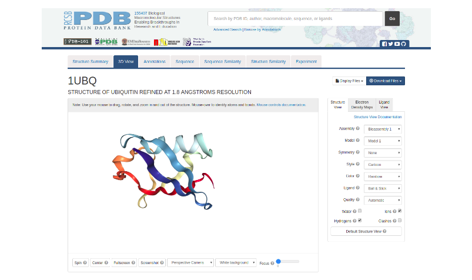

# A vida em três dimensões: Introdução à Bioinformática Estrutural

##### Autora: Dra. Ana Julia Velez Rueda
>
> Material baseado no material de [Introducción a la Bioinformática de AJVeleRueda](https://github.com/AJVelezRueda/Introduccion_a_la_Bioinformatica)
>
> **LICENSE**: This work is licensed under a
[Creative Commons Attribution-ShareAlike 4.0 International License][cc-by-sa].
>
>[![CC BY-SA 4.0][cc-by-sa-image]][cc-by-sa]

[cc-by-sa]: http://creativecommons.org/licenses/by-sa/4.0/
[cc-by-sa-image]: https://licensebuttons.net/l/by-sa/4.0/88x31.png
[cc-by-sa-shield]: https://img.shields.io/badge/License-CC%20BY--SA%204.0-lightgrey.svg

## Origami molecular

A Bioinformática Estrutural se concentra principalmente em explorar a relação entre a estrutura e a função de macromoléculas biológicas, e promove o desenvolvimento de ferramentas computacionais para elucidar as bases estruturais da função biológica. Como são entidades dinâmicas, a relação estrutura-função em macromoléculas biológicas (como proteínas ou ácidos nucléicos, mais especificamente) é formulada como uma relação estrutura-dinâmica-função. É por isso que esta disciplina é fundamental para a compreensão de vários tópicos que vão desde o design racional de fármacos até a regulação da expressão gênica. Esta área da bioinformática pode contribuir do ponto de vista conceitual, aumentando nosso conhecimento sobre as bases dos mecanismos de um determinado sistema, mas a Bioinformática Estrutural também está intimamente ligada aos desenvolvimentos Biotecnológicos, Farmacêuticos e Medicinais.

Uma aproximação a esse grande mundo da bioinformática estrutural pode ser feita a partir do estudo particular, mas muito amplo, das proteínas.

## Um problema em três dimensões

As proteínas são as unidades funcionais, estruturais e evolutivas das células. Sabemos pelos primeiros trabalhos realizados por Anfinsen que **existe uma forte relação entre estrutura e função**, ou seja, a atividade biológica de uma proteína depende do arranjo espacial de sua cadeia polipeptídica. Um grande número de proteínas requer uma determinada estrutura terciária (como chamamos sua estrutura tridimensional) para cumprir suas funções biológicas. Quatro níveis diferentes são definidos, conhecidos como estrutura primária, secundária, terciária e quaternária, e cada um deles é constituído a partir do anterior.

Hoje sabemos que, embora as proteínas possam adotar uma estrutura definida, elas não estão paradas e existem muitas dobras possíveis que explicam sua funcionalidade. Em um dos primeiros trabalhos que estudaram a relação entre a estrutura e a função das proteínas, Pauling e Mirsky definiram o estado nativo das proteínas como um dobramento ou conformação característica, que confere às proteínas sua função, e cuja perda chamou de desnaturação (Mirsky e Pauling, 1936).

Em sua superfície, as proteínas são moldadas em numerosas cavidades e protuberâncias que criam microambientes exclusivos para ligação de ligantes ou catálise. E como as proteínas se movimentam, as cavidades também têm topologias dinâmicas, com características que também podem mudar de uma conformação para outra. A dinâmica dessas cavidades é crítica para entender a função da proteína.

Hoje sabemos que existem muitos enovelamentos possíveis que explicam a funcionalidade da proteína, ou seja, o estado nativo não é único, e atualmente é descrito como um conjunto de conformações em equilíbrio dinâmico. A distribuição relativa das diferentes conformações pode variar devido a mudanças no ambiente da proteína (presença de ligantes, flutuações de pH, modificações pós-traducionais, etc.) (Kumar et al., 2000; Rueda et al., 2018). A magnitude da diversidade conformacional observada nas proteínas pode variar desde flutuações nas cadeias laterais até rearranjos globais da estrutura terciária (Böttcher et al., 2000; Koshland, 1998; Plapp, 2010). Mesmo pequenas mudanças conformacionais geram diferenças nas estruturas das proteínas (cavidades e túneis) que são descritas na estrutura tridimensional, tendo efeitos em sua função.

Mas é claro que saber a estrutura de uma proteína de maneira computacional apresenta certas complexidades. Existem formas de representar a informação tridimensional de uma molécula no computador. Também existe uma infinidade de aplicativos gratuitos que nos permitem visualizar desde a estrutura de uma pequena molécula até uma proteína, e que também nos permitem explorar com mais profundidade as subestruturas das proteínas. Vamos começar com uma exploração de uma estrutura tridimensional de uma molécula simples:

>
> 🧗🏻‍♀️ Desafio I: Vamos explorar como passamos de um plano, uma sequência ou um desenho para uma estrutura tridimensional. Abra a ferramenta [MolView](https://molview.org/) em seu navegador e mova a molécula visualizada na ferramenta
>
> 🧗🏻‍♀️Desafio II: Agora digite `N-Butan` no buscador para ver o que a ferramenta te mostra, depois tente `1-butene` e `1-Butyne`. Que diferenças você vê entre essas moléculas em sua disposição no espaço? Como você imagina que a informação deve ser armazenada em um computador para poder ir do plano para algo tridimensional?
>

Como você deve se lembrar na geometria, um sistema de coordenadas é um sistema de referência que usa números para determinar a posição de um objeto ou ponto no espaço. Para armazenar informações estruturais sobre uma molécula de maneira computacional, devemos recorrer a esse conhecimento básico de geometria para fornecer ao computador uma maneira fácil de interpretar os dados espacialmente.

Como você deve ter notado, ao utilizarmos o plano, na tela à esquerda da ferramenta, obtemos duas coordenadas para descrever a posição de cada espaço. Porém, quando passamos para uma figura tridimensional, apenas duas coordenadas dificultam a determinação da localização do ponto (ou neste caso, átomo) no espaço; e torna-se necessário utilizar um eixo de 3 coordenadas. Existe um tipo de arquivo muito comum em bioinformática, que é comumente usado para armazenar esse tipo de informação geométrica, que é conhecido como arquivo `PDB` e no qual muitas ferramentas realizam diferentes análises estruturais que podemos ver abaixo.

Existem muitas maneiras de estudar a relação entre estrutura e função da proteína e as implicações dessa relação, portanto, tentaremos resumir alguns aspectos básicos da análise.

Vamos mergulhar na anatomia das proteínas!

## Um problema estrutural

Mas como melhor do que dizer é fazer, vamos nos concentrar agora em um sistema concreto para estudar suas características estruturais. A ubiquitina (ubiquitin em inglês) é uma proteína pequena que foi encontrada em todas as células eucariontes (daí vem seu nome: "ubiquo" significa onipresente). Essa proteína é responsável pela marcação química de proteínas que não são mais necessárias, para que sejam reconhecidas e destruídas por outras proteínas.

>**PARA PENSAR** 🤔: Por que uma célula quer destruir suas próprias proteínas?

Vamos descobrir um pouco mais sobre a estrutura terciária da ubiquitina. Para isso, entraremos no site do Banco de Dados de Proteínas (Protein Data Bank, o PDB) (https://www.rcsb.org/). Esta página web corresponde a uma das bases de dados mais utilizadas na bioinformática, onde se encontram armazenadas todas as estruturas de macromoléculas biológicas obtidas até o momento. As estruturas são armazenadas em forma de arquivos que contêm as coordenadas no espaço, em eixos imaginários X, Z e Y, de todos os átomos de uma molécula dada. Estas coordenadas podem ser interpretadas por alguns programas gráficos para mostrar de forma tridimensional como se vería, por exemplo, uma proteína em uma célula ou em uma membrana.

No quadro de busca do PDB, inserimos o código identificador da ubiquitina humana: 1UBQ.

A página correspondente ao 1UBQ contém todas as informações disponíveis sobre o experimento que determinou a estrutura terciária da ubiquitina humana. Também inclui informações adicionais sobre a proteína extraída de outras bases de dados, o que permite saber mais sobre sua sequência, outras proteínas semelhantes, etc. A primeira tela que vemos é um resumo da informação estrutural (Structure Summary).

>**PARA PENSAR** 🤔: Que informações esta página nos fornece?
>
>**PARA PENSAR** 🤔: Como se determinou a estrutura desta proteína?
>
>**PARA PENSAR** 🤔: Esta imagem representa a realidade do sistema biológico?
>
>**PARA PENSAR** 🤔: A estrutura 1UBQ foi "refinada para uma resolução de 1,8 Angstroms". Este é o erro associado ao experimento: quanto maior a resolução, menor a certeza de determinar a posição de cada átomo. Qual é a utilidade e as restrições de usar um modelo científico que sabemos ser impreciso?
>

Vamos explorar a guia de visualização tridimensional (3D View). Com o mouse podemos girar, aproximar e deslocar a molécula. O menu da direita nos permite alterar o modo de representação.
Na tela principal, vemos uma representação da estrutura da ubiquitina.

>**PARA PENSAR** 🤔: O que significam as fitas, setas e regiões estreitas?
>
>**PARA PENSAR** 🤔: Que diferenças e semelhanças notamos em relação à representação inicial (do Structure Summary)?
>
>**PARA PENSAR** 🤔: No menu há opções para diferentes tipos de representação e formas de colorir a estrutura tridimensional. Qual a utilidade de visualizar a mesma coisa de maneiras diferentes?

Voltando à página principal da estrutura, podemos usar o menu direito para baixar um arquivo (Download files) com as coordenadas espaciais de cada átomo desta proteína. No pequeno menu que se abre, podemos baixar a estrutura da proteína no formato PDB (PDB Format), o padrão para estruturas de biomoléculas.

>**PARA PENSAR** 🤔: Que informação você esperaria encontrar como resultado de um experimento que determina a estrutura terciária de uma molécula biológica?

Podemos explorar o conteúdo do arquivo que acabamos de baixar, vamos observar com um editor de texto. Fazendo clique com o botão direito do mouse sobre o arquivo baixado, usamos a opção Abrir e selecionamos o Bloco de Notas ou outro editor de texto.

>**PARA PENSAR** 🤔: O que é um arquivo PDB?
>
>**PARA PENSAR** 🤔: Vamos percorrer o arquivo até encontrar as linhas que começam com a palavra ATOM. Que tipo de informação é armazenada nessa seção?
>
>**PARA PENSAR** 🤔: Poderíamos extrair desse arquivo informações sobre a estrutura primária da proteína em questão? Como essa informação é apresentada e o que significa a representação? Do ponto de vista computacional: de que tipo de dados se trata essa informação?
>
>**PARA PENSAR** 🤔: Você acha que o formato PDB é útil para apresentar os resultados do experimento?
>
>**PARA PENSAR** 🤔: Observamos que a informação respeita uma certa estrutura interna. Quais são os benefícios e as limitações de importar uma estrutura para comunicar os resultados de um experimento?
>
> Vimos que as proteínas têm uma estrutura tridimensional e pudemos observar algumas de suas características. Será o mesmo com os ácidos nucléicos?
Rosalind Franklin é uma cientista muito relevante, que recebeu menos reconhecimento do que merecia. Conte-nos sobre os procedimentos que Rosalind realizou.
>

## Uma solução no bolso

O estudo estrutural de proteínas nos proporciona múltiplos campos de aplicação, por exemplo, um dos mais explorados atualmente é o desenho racional de fármacos. Conhecendo-se a base biológica de uma doença, ou seja, conhecendo-se as moléculas envolvidas, é possível desenhar um fármaco que interaja com a molécula responsável, de forma que a modifique e esta modifique o quadro patológico. Em outras palavras, o desenho racional de fármacos consiste na aplicação do conhecimento biológico e estrutural dos receptores (proteínas envolvidas em uma determinada doença) para desenhar moléculas que interajam apenas com eles... tanto quanto possível!

Um estudo de caso interessante é o [EGFR](https://www.uniprot.org/uniprotkb/P00533/entry), um dos principais marcadores de câncer de pulmão. Ele apresenta características diferenciais entre as conformações ativas e inativas que tentaremos explorar computacionalmente.

Existe uma grande variedade de softwares capazes de prever a localização dessas subestruturas proteicas e suas propriedades. E esta informação, combinada com informação evolutiva e da sequência, pode ser muito útil para entender a natureza da função da proteína. Todas essas informações são combinadas de forma simples de visualizar e processar no [CaviDB](https://cavidb.org). [CaviDB](https://cavidb.org) é uma base de dados on-line gratuita que fornece informações sobre cavidades de proteínas e suas propriedades, o que também permite estudar a diversidade conformacional das cavidades proteicas.

Vamos começar estudando essa proteína, analisando as diferenças e semelhanças entre suas conformações ativas e inativas:

         - A estrutura 1M14 corresponde a uma conformação ativa: ou seja, uma estrutura com atividade

         - A estrutura 3W32 corresponde a uma conformação inativa.

>
>🧗🏻‍♀️DESAFIO III: Compare o sítio ativo de ambos os confôrmeros (posição 837), bem como os tamanhos dos pockets. O que você observa?
>
>🧗🏻‍♀️DESAFIO IV: Pesquise mais sobre a proteína usando a base de dados [Uniprot](https://www.uniprot.org/) e anote os sítios biologicamente relevantes
>
> 🧗🏻‍♀️DESAFIO V: Algum sítio de relevância biológica coincide com outras cavidades previstas nas conformações ativa e inativa?
>
> 💡 Para Investigar: Investigue em que consiste o docking, em que ideias se baseia o seu funcionamento. Como este método poderia ser utilizado para tratar o câncer?
>

## Sobre as camadas da evolução

As albuminas são as proteínas químicas mais abundantes nos mamíferos e têm a principal propriedade de unir e transportar muitos compostos endógenos e exógenos (hidrofóbicos, em sua maioria). A proteína é globular e é composta por três domínios homólogos (I, II e III), cada um dos quais contém dois subdomínios semelhantes (A e B). As albuminas são conservadas nos vertebrados e os membros desta família mostram uma grande diversidade estrutural, apesar da conservação global da sequência. Assim, embora sua função biológica não seja enzimática, sua capacidade catalítica foi provada em várias reações. Curiosamente, embora todas as albuminas de mamíferos compartilhem a função principal de transporte de ligantes através do sangue, elas diferem no tipo de reações que podem catalisar. Além disso, a capacidade catalítica das albuminas em solventes orgânicos as torna candidatas econômicas para manipulação biotecnológica para uso em processos industriais.

Em particular, a albumina sérica humana (HSA) é a principal proteína plasmática, ligando-se a múltiplos ligantes e foi recentemente descrita como um importante transportador de fármacos. Essa proteína de cadeia única possui vários sítios de ligação para fármacos e ácidos graxos, porém, a maioria deles se liga aos chamados Sítios I (Met 1 a Asn 111) e II (de Gln 196 a Pro 303). Em particular, os resíduos Lys 199, Arg 410, Tyr 411, Cys 34 e Lys 195 da HSA são descritos como alguns dos mais importantes, não apenas para a ligação com ligantes, mas também para as atividades catalíticas descritas para esta proteína.

Sabe-se que a capacidade catalítica de uma cavidade geralmente está associada a algumas de suas características estruturais, como a presença de aminoácidos ativos (com pKas anormais) em ambientes majoritariamente hidrofóbicos.

>
> 🧗🏻‍♀️DESAFIO VI: Investigue no [CaviDB](https://cavidb.org) as características estruturais da Albumina Humana na estrutura `1AO6A`:
>
> - Quantas cavidades foram previstas para essa estrutura? Quais são as principais cavidades em termos de tamanho de proteína? Existem cavidades que se sobrepõem aos resíduos descritos como relevantes para a atividade enzimática da albumina?
>
> - Alguma das cavidades cataliticamente ativas está ativada? Quais faixas de pKa são observadas em tais cavidades?
>
> 🧗🏻‍♀️ DESAFIO VII: Sabe-se que na albumina bovina, o sítio ativo é deslocado do humano, embora também envolva um aminoácido carregado (Lys 221). Investigue no [CaviDB](https://cavidb.org) as características estruturais da estrutura da albumina bovina `4JK4A` e compare as características do seu sítio ativo com as características do sítio ativo da albumina humana (Lys 199)
>
> 💡 Para analisar: Leia mais sobre as [descobertas](https://www.sciencedirect.com/science/article/abs/pii/S0300908422000426) feitas por cientistas da Universidade Nacional de Quilmes sobre a evolução das albuminas e compare-as com o que você pode observar.
>
