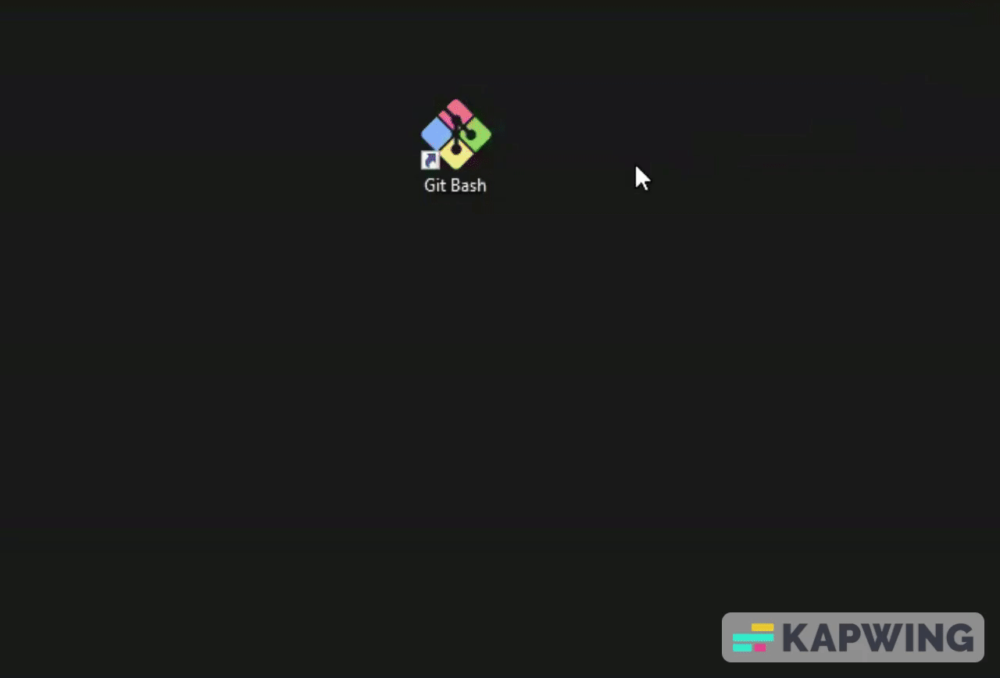

# CONTROL DE VERSIONES

🚨 Este material foi criado pela Dra. Ana Julia Velez Rueda e Dra. Liliane Conteville
[Creative Commons Attribution-ShareAlike 4.0 International License][cc-by-sa].

[![CC BY-SA 4.0][cc-by-sa-image]][cc-by-sa]

[cc-by-sa]: http://creativecommons.org/licenses/by-sa/4.0/
[cc-by-sa-image]: https://licensebuttons.net/l/by-sa/4.0/88x31.png
[cc-by-sa-shield]: https://img.shields.io/badge/License-CC%20BY--SA%204.0-lightgrey.svg

##  Introducción

[쯈ué es un sistema de control de versiones?](#control-de-versiones)
Un sistema de control de versiones es una herramienta que realiza un seguimiento de los cambios de un documento o directorio de forma automática, creando efectivamente diferentes versiones de nuestros archivos. Los sistemas de control de versiones comienzan con una versión base del documento y luego registran los cambios que realiza en cada paso del camino. Existen múltiples programas que nos permiten realizar un control de versiones de nuetsros prosyectos, pero en este tutorial veremos cómo utilizar [Git](https://git-scm.com/downloads), uno de los más populares en la actualidad.

Para comprender mejor qué hace Git se podría pensar que es un artista que intenta crear una película de [`stop motion`](https://es.wikipedia.org/wiki/Animaci%C3%B3n_en_volumen). Como bien sabrán, la construcción de estas películas requiere de muchas fotos que resgistren los movimientos de los personajes al detalle. Pensemos entonces que Git toma fotos instantáneas de los cambios durante la vida de un proyecto, para construir su película. Se podría pensar al proyecto entonces como un video: sobre el que se puede retroceder para comenzar en el documento inicial y reproducir cada estado o cambio que realizó, hasta llegar finalmente a su versión más reciente.

Cada registro de estos cambios se denomina `commit` y mantiene metadatos (referencias temporales y de autorías, etc) útiles sobre ellos. El historial completo de `commits` para un proyecto en particular y sus metadatos forman un `repositorio`. 


Siguiendo con la analogía del video, podemos pensar cada `commit` como un fotograma en nuestro video, siendo este el historial completo de cambios de un archivo o directorio. Pero antes de tomar la foto, no sería mala idea preparar a nuestros personajes y apuntar la cámara adecuadamente para que sea capaz de capturar estos cambios adecuadamente. Entonces, al hacer `git add` lo que hacemos es especificar qué movimientos de los personajes quedarán registrados en la próxima foto (colocando las cosas en el área `index` de Git), algo así como gritar `cheeese` para que nadie salga con mala cara. Y luego, cuando hacemos `git commit` le indicamos a Git que es momensto de tomar la foto y registrar de forma permanente los movimientos o cambios en el estado de nuestros personajes.


En resumen, Git tiene un área de preparación `index` a la que podemos agregar elementos con `git add`. Los cambios no se documentan de forma permanentehasta que los confirmamos con `git commit`. Los cambios se gestionan como una unidad, al generar un `commit`, y quedan registrados al hacer `git commit`. Esto nos permite enviar grupos específicos de archivos al mismo tiempo o separados, según lo que deseemos.


📑 [**NOTA**]: Es muy importante especificar los cambios realizados en cada `commit`, esto nos ayudará a rastrear cualquier cambio al querer volver atrás.

Ahora bien 쯈ué pasa si alguno de los cambios que hicimos no nos sirve? Bueno, como en pasa en la vida real, las cosas pueden "malir sal" y vamos a necesitar volver a empezar. Pero por su puesto que no vamos a comenzar desde cero si llevamos buen rato trabajando en el proyecto.. ehem! ¡mejor dicho, en la película! Es por eso que quizás nos venga bien guardar las fotos que nos pueden servir en un futuro en una cajita que llamaremos `stash`, haciendo `git stash`. Pero ojo, que siempre se puede reutilizar aquello que dejamos `stasheado` haciendo `git stash apply`. 

## Git al infinito y más allá...

Git trabaja con un repositorio local que está en tu computadora, donde vas a ir agregando tus commits y uno remoto (en la nube) en el cual podes subir tus commits, compartirlos con alguien más o bajarte los commits que haya subido alguien.

Existen varios varios servicios para almacenar repositorios remotamente:

- [Github](https://github.com) 
- [Bitbucket](https://bitbucket.com)
- [Gitlab](https://gitlab.com/)

Para usarlos deberás registrarte y crear una cuenta. 

>
>🏅 Desafío I: Creá tu cuenta en [GitHub](https://github.com/) ¡Tené a mano tu nombre de usuarie y contraseña, lo vas a necesitar!
>

## *Instalar el Git*

Para continuar con este tutorial, deberá tener Git instalado en su computadora y GitHub configurado correctamente.

En el material de [Primeros Pasos](https://github.com/WomenBioinfoDataScLA/WBDSLA_PreCamp_PT/blob/main/%5BES%5DPrimeros_Pasos.md), te explicamos cómo descargar e instalar el `Git Bash`en caso de que tenga Sistema Operativo Windows en su computadora. Este programa ya viene con Git instalado.

Si tiene un sistema operativo Linux o macOS en su computadora, abra una `terminal`.

Con GitBash o una terminal abierta, primero verifiquemos si ya tiene Git instalado. Para hacer esto, pegue el siguiente comando en la terminal y presione enter. Una de las formas de pegar un texto en la terminal es presionando el botón derecho del mouse y luego haciendo clic en `Paste` o `Pegar`. 

```bash
git --version
```




Si aparece un mensaje como: `git version 2.38.1`, ya tienes Git instalado, así que omite ese paso de instalación y ve al paso de configuración en este tutorial.

Si no vio un mensaje con su versión de git después de ejecutar `git --version`, siga los siguientes pasos para realizar la instalación.

### macOS
Git para macOS se puede descargar [aquí](https://sourceforge.net/projects/git-osx-installer/files/).


Abra el archivo descargado para iniciar el instalador. Siga los pasos de instalación hasta que se complete con éxito. Luego abre el programa.

Confirme que la instalación funcionó ejecutando `git --version` nuevamente y vea si esta vez hay información sobre la versión instalada.

### Linux

Con la terminal abierta, ejecuta los siguientes comandos:

```bash
sudo apt-get update 

sudo apt-get install git
```

Para asegurarse de que la instalación funcionó, ejecute `git --version` nuevamente y vea si esta vez hay información sobre la versión instalada.

## *Configura tus datos*
Con git instalado en su computadora, ahora configuremos su correo electrónico y nombre de usuario usando los siguientes comandos. Pero recuerda reemplazar `<tu login>` con tu nombre y `<tu email>` con tu correo electrónico personal.


```bash
git config --global user.name <tu login>

git config --global user.email <tu email>
```

📑 [**NOTA**]: Si necesita más información, consulte la documentación en el sitio web [github](https://docs.github.com/en/get-started/getting-started-with-git/about-remote-repositories#cloning-with-ssh-urls).

## *쮻칩nde guardar mis repositorios?*

Como se mencionó anteriormente, Git funciona con un repositorio local que está en su computadora. Luego, debemos mostrarle dónde queremos almacenar nuestros repositorios en nuestra máquina.

Comencemos por crear una carpeta donde se almacenarán los repositorios. Para esto, usaremos algunos comandos aprendidos en el tutorial de Bash/Linux:

```bash
cd ~/Desktop

mkdir Proyectos

cd Proyectos
```

Ahora que estamos dentro de la carpeta `Proyectos`, inicialicemos un repositorio git en la raíz de la carpeta, ejecute el siguiente comando:

```bash

git init

````

😍 Ahora estamos con todo listo para comenzar la parte práctica de este tutorial, que se puede encontrar en [1.Practica.md](%5BES%5D1.Practica.md)