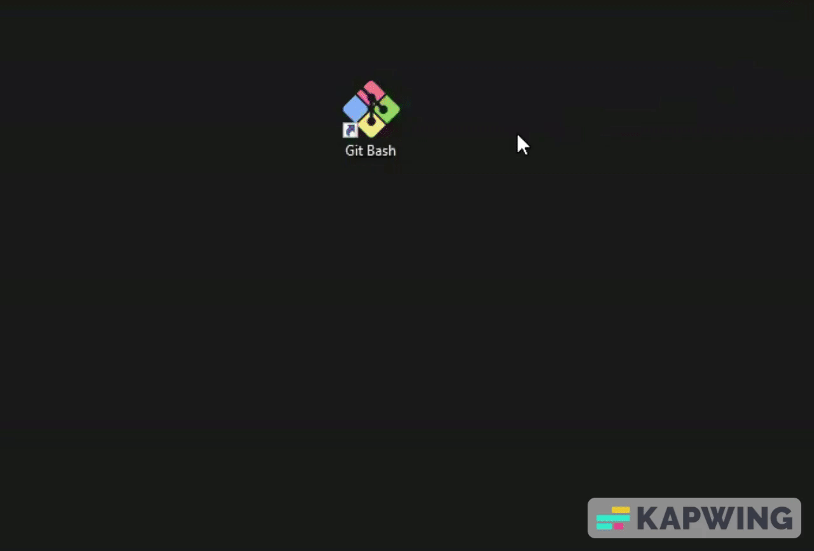
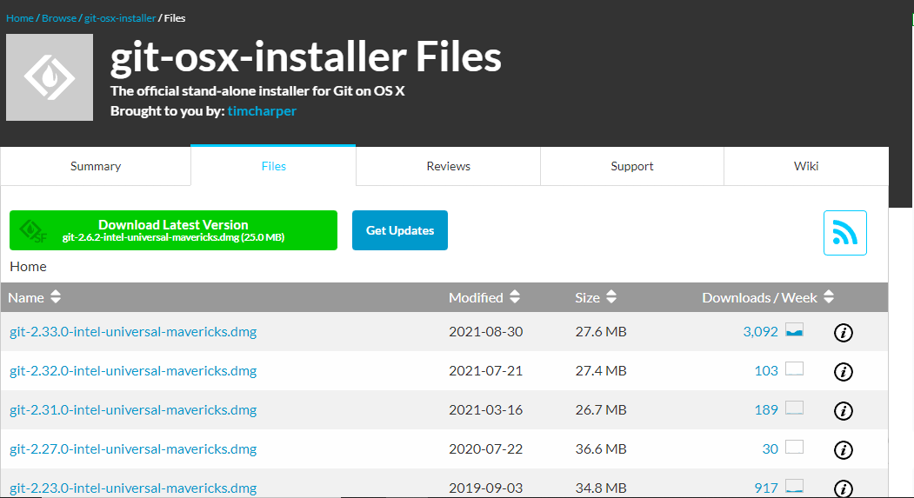

### CONTROLE DE VERSÕES

🚨 Este material foi criado pela Dra. Ana Julia Velez Rueda e Dra. Liliane Conteville
[Creative Commons Attribution-ShareAlike 4.0 International License][cc-by-sa].

[![CC BY-SA 4.0][cc-by-sa-image]][cc-by-sa]

[cc-by-sa]: http://creativecommons.org/licenses/by-sa/4.0/
[cc-by-sa-image]: https://licensebuttons.net/l/by-sa/4.0/88x31.png
[cc-by-sa-shield]: https://img.shields.io/badge/License-CC%20BY--SA%204.0-lightgrey.svg

##  Introdução

[O que é um sistema de controle de versões?](#version-control)
Um sistema de controle de versões é uma ferramenta que acompanha automaticamente as alterações em um documento ou diretório, criando efetivamente diferentes versões de nossos arquivos. Os sistemas de controle de versões começam com uma versão básica do documento e, em seguida, registram as alterações feitas em cada etapa do processo. Existem vários programas que nos permitem realizar o controle de versões de nossos projetos, mas neste tutorial veremos como usar o [Git](https://git-scm.com/downloads), um dos mais populares atualmente.

Para entender melhor o que o Git faz, você pode pensar nele como um artista tentando criar um filme [`stop motion`](https://pt.wikipedia.org/wiki/Stop_motion). Como você sabe, a construção desses filmes exige muitas fotos que registram detalhadamente os movimentos dos personagens. Vamos pensar então que o Git tira fotos instantâneos das mudanças durante a vida de um projeto para construir seu filme. Você poderia então pensar no projeto como um vídeo: um que você pode voltar no documento inicial e repetir cada estado ou mudança que você fez, até finalmente chegar à sua versão mais recente.

Cada registro dessas mudanças é chamado de `commit` e mantém metadados úteis (tempo e referências de autor, etc) sobre elas. O histórico completo de `commits` para um projeto específico e seus metadados formam um `repositório`.


Continuando com a analogia do vídeo, podemos pensar em cada `commit` como um quadro em nosso vídeo, sendo este todo o histórico de alterações de um arquivo ou diretório. Mas antes de tirar a foto, não seria uma má ideia preparar nossos personagens e apontar a câmera corretamente para que ela seja capaz de capturar essas mudanças, né? Então, quando fazemos `git add` o que fazemos é especificar quais movimentos de caracteres serão gravados na próxima foto (colocando as coisas na área `index` do Git), como gritar `cheeese` para que ninguém saia mal na foto. E então quando fazemos `git commit` dizemos ao Git que é hora de tirar uma foto e registrar de forma permanentemente os movimentos ou mudanças de nossos personagens.


Resumindo, o Git tem uma área de teste `index` à qual podemos adicionar itens com `git add`. As alterações não são documentadas permanentemente até que as confirmemos com `git commit`. As mudanças são gerenciadas como uma unidade, gerando um `commit`, e são registradas fazendo `git commit`. Isso nos permite enviar grupos específicos de arquivos ao mesmo tempo ou separadamente, dependendo do que queremos.

📑 [**NOTA**]: É muito importante especificar as alterações feitas em cada `commit`, isso nos ajudará a rastrear as alterações quando quisermos voltar atrás.

Agora, o que acontece se alguma das alterações que fizemos não funcionar para nós? Bem, como acontece na vida real, as coisas podem "dar errado" e precisaremos recomeçar. Mas é claro que não vamos começar do zero se já estamos trabalhando no projeto há muito tempo... quer dizer, no filme! É por isso que pode ser bom para nós salvar as fotos que podem ser úteis no futuro em uma caixinha que chamaremos de `stash`, fazendo `git stash`. Você sempre pode reutilizar o que deixou `stashed` fazendo `git stash apply`.

## Git ao infinito e além...

O Git funciona com um repositório local que está no seu computador, onde você vai adicionar seus commits e um repositório remoto (na nuvem) no qual você pode fazer upload de seus commits, compartilhá-los com outra pessoa ou baixar os commits que alguém carregou .

Existem vários serviços para armazenar repositórios remotamente:

- [Github](https://github.com) 
- [Bitbucket](https://bitbucket.com)
- [Gitlab](https://gitlab.com/)

Para usá-los você deve se registrar e criar uma conta.

>
>🏅 Desafio I: Crie sua conta no [GitHub](https://github.com/). Tenha seu login e senha à mão, você vai precisar!
>

## *Instalar o Git*

Para seguir acompanhando este tutorial, você precisará ter o Git instalado em seu computador e o GitHub configurado corretamente. 

No material de [Primeiros Passos](https://github.com/WomenBioinfoDataScLA/WBDSLA_PreCamp_PT/blob/main/%5BPT%5DPrimeiros_Passos.md), explicamos como baixar e instalar o `Git Bash`, no caso de você ter o Sistema Operacional **Windows** em seu computador. Esse programa já vem com o Git instalado.

Se você têm o Sistema Operacional **Linux ou macOS** em seu computador, abra um `terminal`.

Com o GitBash ou um terminal aberto, vamos primeiro checar se você já têm o Git instalado. Para isso, cole o comando abaixo no terminal e aperte enter. Uma das formas de colar um texto no terminal é apertando o botão direito do mouse e depois clicar em `Paste` ou `Colar`. 

```bash
git --version
```




Se apareceu uma mensagem como: `git version 2.38.1`, você já têm o Git instalado, então pule essa etapa de instalação e vá para a etapa de configuração neste tutorial.

Se não apareceu uma mensagem com a versão de seu git após correr `git --version`, siga os próximos passos para realizar a instalação.

### macOS
O Git para macOS pode ser baixado [aqui](https://sourceforge.net/projects/git-osx-installer/files/).



Abra o arquivo baixado para iniciar o instalador. Siga os passos de instalação até concluir com êxito. Em seguida, abra o programa.

Confirme que a instalação funcionou correndo `git --version` novamente e veja se dessa vez aparece uma informação sobre a versão instalada.

### Linux

Com o terminal aberto, corra os seguintes comandos:

```bash
sudo apt-get update 

sudo apt-get install git
```

Para ter certeza que a instalação funcionou, corra `git --version` novamente e veja se dessa vez aparece uma informação sobre a versão instalada.

## *Configurar seus dados*
Com o git instalado em seu computador, agora vamos configurar seu e-mail e nome de usuário utilizando os comandos a seguir. Mas lembre-se de substituir `<seu login>` com seu nome e `<seu email>` com o seu email pessoal.

```bash
git config --global user.name <seu login>

git config --global user.email <seu email>
```

📑 [**NOTA**]: Se você precisar de mais informações, cheque a documentação no site do [github](https://docs.github.com/en/get-started/getting-started-with-git/about-remote-repositories).

## *Onde armazenar meus repositórios?*

Como foi dito anteriormente, o Git funciona com um repositório local que está no seu computador. Então precisamos mostrar para ele aonde queremos armazenar os nossos repositórios em nossa máquina.

Vamos começar criando uma pasta em que os repositórios serão armazeados. Para isso, vamos utilizar alguns comandos aprendidos no tutorial de Bash/Linux: 

```bash
cd ~/Desktop

mkdir Projetos

cd Projetos
```

Agora que estamos dentro da pasta `Projetos`, vamos inicializar um repositório git na raiz da pasta, execute o comando a seguir:

```bash

git init

````

😍 Já estamos com tudo pronto para começar de fato a parte prática deste tutorial, que se encontra em [1.Practica.md](%5BPT%5D1.Pratica.md)
