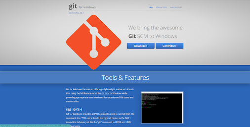

# CONTROLE DE VERSÕES


🚨 Este material foi criado pela Dra. Ana Julia Velez Rueda e Dra. Liliane Conteville
[Creative Commons Attribution-ShareAlike 4.0 International License][cc-by-sa].

[![CC BY-SA 4.0][cc-by-sa-image]][cc-by-sa]

[cc-by-sa]: http://creativecommons.org/licenses/by-sa/4.0/
[cc-by-sa-image]: https://licensebuttons.net/l/by-sa/4.0/88x31.png
[cc-by-sa-shield]: https://img.shields.io/badge/License-CC%20BY--SA%204.0-lightgrey.svg

#  Git Bash

Se você têm o Sistema Operacional Windows em seu computador, uma alternativa interessante para estudar comandos Linux é o `Git Bash`. O Git Bash é um programa para ser instalado no Windows, que interpreta comandos Bash e permite a emulação de um ambiente Linux. Além disso, ele te permite usar o `git`, que vamos conhecer e aprender a usar neste Pre-Camp. 

## *Como instalar*

### Windows
Se você têm o Sistema Operacional Windows em seu computador, o Git pode ser baixado [aqui](https://gitforwindows.org/).



Abra o arquivo baixado para iniciar o instalador. Siga os passos de instalação até concluir com êxito. Em seguida, abra o programa.


### MacOS
Se você têm o Sistema Operacional macOS em seu computador, vamos primeiro checar se você já têm o Git instalado. Se você tiver o XCode instalado, cole o comando abaixo no terminal e aperte enter:

```bash
git --version
```

Se apareceu uma mensagem como: `git version 2.7.0 (Apple Git-66)`, você já têm o Git instalado, então pule essa etapa de instalação e vá para a etapa de configuração neste tutorial.

Se não apareceu uma mensagem com a versão de seu git após correr `git --version`, siga os próximos passos para realizar a instalação.

O Git para macOS pode ser baixado [aqui](https://sourceforge.net/projects/git-osx-installer/files/).


Abra o arquivo baixado para iniciar o instalador. Siga os passos de instalação até concluir com êxito. Em seguida, abra o programa.

Confirme que a instalação funcionou correndo `git --version` novamente e veja se dessa vez aparece uma informação sobre a versão instalada.

### Linux

Se você têm o Sistema Operacional Linux em seu computador, vamos primeiro checar se você já têm o Git instalado. Abra o terminal (Ctrl+Alt+T), cole o comando abaixo e aperte enter:

> git --version

Se apareceu uma mensagem como: `git version 2.7.0`, você já têm o Git instalado, então pule essa etapa de instalação e vá para a etapa de configuração neste tutorial.

Se não apareceu uma mensagem com a versão de seu git após correr `git --version`, siga os próximos passos para realizar a instalação.

Com o terminal aberto, corra os seguintes comandos:

```bash
sudo apt-get update 

sudo apt-get install git
```

Para ter certeza que a instalação funcionou, corra `git --version` novamente e veja se dessa vez aparece uma informação sobre a versão instalada.

## *Configurar seus dados*
Com o git instalado em seu computador, abra o Git Bash (se você tiver windows) ou o terminal (se você tiver macOS ou Linux).

Agora vamos configurar seu e-mail e nome de usuário utilizando os comandos a seguir. Mas lembre-se de substituir `<seu usuário>` com seu nome e `<seu email>` com o seu email pessoal.

```bash
git config --global user.name <seu usuário>

git config --global user.email <seu email>
```

## Configurar 

Agora vamos inicializar um repositório Git nesta pasta que estamos.

```bash
git init
````