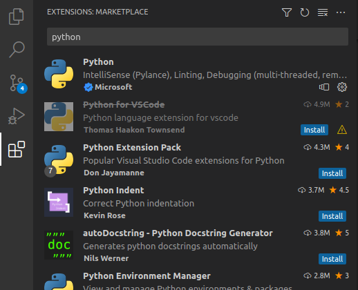
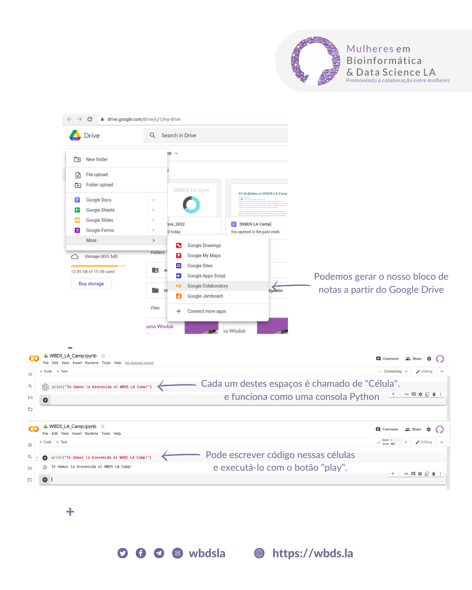

# *Scripting e IDEs*

🚨Este material foi criado pela Dra. Ana Julia Velez Rueda e Franco Leonardo Bulgarelli. Está licenciado sob
[Creative Commons Attribution-ShareAlike 4.0 International License][cc-por-sa]. É necessário elementos de [Python Resources](https://flbulgarelli.github.io/recursos-python/), sob a mesma licença.


[![CC BY-SA 4.0][cc-by-sa-image]][cc-by-sa]

[cc-by-sa]: http://creativecommons.org/licenses/by-sa/4.0/
[cc-by-sa-image]: https://licensebuttons.net/l/by-sa/4.0/88x31.png
[cc-by-sa-shield]: https://img.shields.io/badge/License-CC%20BY--SA%204.0-lightgrey.svg

## O que é um script? 💬

Um _script_ é basicamente um conjunto de instruções ordenadas, que têm o objetivo de resolver uma tarefa específica. ⛔ Espera, isso soa muito como a definição de um _programa_, não soa?

Muito bem, você já entendeu! É que os scripts **são** programas, mas têm algumas características particulares:

 1) Normalmente interagem com bibliotecas de sistemas operativos, seja diretamente ou através de comandos bash;
 2) São normalmente executados num terminal (_shell_) e geralmente contra um intérprete;
 3) Normalmente não têm uma interface gráfica, mas todas as interações ocorrem através de entradas e saídas de texto;
 4) Recebem argumentos a partir do terminal;
 5) Devolvem um código de saída numérico e inteiro (`0` por padrão e em caso de sucesso);
 6) Operam principalmente contra arquivos e _data streams_, tais como entrada padrão (`stdin`), saída padrão (`stdout`) e erro padrão (`stderr`).

Mais concretamente, os scripts são geralmente escritos em texto simples, utilizando uma linguagem de programação _interpretada_, tal como Python, Perl, Ruby ou Bash, e a sua extensão variará de acordo com a sua linguagem. Por exemplo, os scripts em Python utilizam a extensão `.py`, e os escritos em Bash, `.sh` (ou sem qualquer extensão).

## Para quê queremos scripts?

Os scripts são particularmente úteis para automatizar tarefas que são executadas periodicamente (também conhecidas como tarefas programadas ou calendarizadas) ou para automatizar situações tediosas como, por exemplo:

 * Executar um conjunto de programas e combinar os seus resultados;
 * Baixar, carregar, mover e/ou descompactar arquivos;
 * Realizar conversões de formato;
 * Executar tarefas de construção de projetos de software, tais como compilação, teste e publicação;
 * Executar tarefas de manutenção do sistema operativo, tais como instalação e configuração de software, liberação de espaço, etc.

## Quais linguagens são usadas para escrever scripts?

Como já dissemos, as linguagens utilizadas para a escrita são geralmente interpretadas, ou seja, são executadas diretamente contra um programa de interpretação que lê e executa as instruções, em vez de exigir uma compilação prévia (como seria por exemplo o caso de Java, C ou Go).

Isto porque quando programamos scripts, preocupamo-nos que a escrita de tais programas seja rápida e fácil, mas não que a sua execução seja rápida (as linguagens compiladas normalmente optimizam o nosso código para reduzir o tempo de execução e os recursos em geral). Além disso, as linguagens de scripting tendem a oferecer uma fácil integração para executar programas externos, gerir arquivos e interagir com o sistema operativo em geral.

## Estrutura dos scripts em Python 🧱

Os scripts têm sempre um único ponto de entrada, ou _main_, que é o que será executado quando invocado a partir do terminal.

Em Python, podemos fazer isto de duas maneiras. Uma delas é a forma mais "básica", que é ter um arquivo normal `.py`, que importa os pacotes necessários e executa as operações. Por exemplo, digamos que queremos fazer um script que diga simplesmente "olá mundo" e termine. Para isso, criaríamos um arquivo `hello.py` contendo:

```python
print("olá mundo")
```

Como alternativa, podemos escrevê-lo de uma forma um pouco mais complexa, mas mais "clássica" e conceitualmente correta:

```python
def main():
    print("olá mundo")

if __name__ == "__main__":
  main()
```

E isso é tudo! Este é provavelmente um dos scripts mais simples que podemos fazer.

## Como executamos um script? 🤔

Agora, como é que o executamos? A forma mais óbvia é executar o arquivo a partir do terminal, utilizando o caminho absoluto ou relativo para o arquivo, invocando diretamente o intérprete apropriado. Por exemplo, fazendo:


```bash
python3 hello.py
```

Embora claramente mais simples, este atalho pode ter algumas desvantagens em relação à utilização de todos os passos ditos anteriormente, já que obriga quem usa o nosso script a conhecer o intérprete contra o qual o script deve ser executado.

Seria melhor se a pessoa que usa o nosso script não tivesse que saber qual o intérprete contra o qual executar o arquivo, não seria? Em outras palavras, poder simplesmente rodar `./hello.py`. Mas como é que o sistema reconheceria que este arquivo, que à primeira vista parece um arquivo de texto comum, tem de ser executado como um script?

Em **linux**, todos os arquivos de texto simples são apenas texto simples, por isso, não importa a extensão que lhes damos. Então temos que dizer de alguma forma que um determinado arquivo é um script contendo comandos a serem executados. Para isso, precisamos:

1) Em primeiro lugar, começar digitado `#!`, que é conhecido como shebang, seguido pelo caminho do intérprete contra o qual o seu script será executado (Python, neste caso). Em sistemas Linux ficaria: `#!/bin/python3`.

2) Em segundo lugar, o arquivo deve ter permissões de execução. Como já vimos, isso pode ser feito utilizando o comando `chmod` cujas opções são:

    `+r`, `+w` ou `+x` para dar permissões de leitura, escrita ou execução a um arquivo, respectivamente.

    `-r`, `-w` ou `-x` para os remover.


    Estas opções podem ser combinadas. Portanto, se quisermos dar todas as permissões a um arquivo, podemos fazer:

    ```bash
    chmod +rwx arquivo
    ```

3) Finalmente, devemos executar o arquivo utilizando o caminho completo (absoluto) para o arquivo ou se estamos na pasta onde o arquivo se encontra, podemos utilizar o `./nome_do_script.py`.

Por exemplo, o nosso `hello.py` terá este aspecto:

```python
#!/bin/python3

def main():
    print("olá mundo")

if __name__ == "__main__":
  main()
```

## IDEs ou Ambientes de Desenvolvimento 

Para escrever confortavelmente os nossos scripts, precisaremos de uma ferramenta chamada editor de código, que se parece muito com um editor de texto, mas não é para escrever poemas, currículos, ou trabalhos escolares (onde nos preocupamos com a verificação ortográfica, sublinhado, negrito, ou mudança de cores), mas sim para criar programas complexos. :star_struck:

Muitos destes editores de código (ou editores simples, a partir de agora) podem ser instalados no seu próprio computador. Alguns deles são:

* [Sublime](https://www.sublimetext.com/);
* [Visual Studio Code](https://code.visualstudio.com/);
* [Atom](https://atom.io/);
* [Vim](https://www.vim.org/).

Além disso, para desenvolver aplicações e sistemas mais complexos, existem ferramentas ainda mais completas (e complexas! :sweat:) conhecidas como Ambientes de Desenvolvimento Integrado (_IDEs_). Uma das mais populares é o [PyCharm](https://www.jetbrains.com/es-es/pycharm/). Existem também IDEs em linha tais como [Colaboratory](https://colab.research.google.com/) e [Jupyter](https://jupyter.org/) que não precisamos baixar no computador. :músculo:

Com exceção do Colab e Jupyter, para utilizar qualquer um destes editores e ambientes de desenvolvimento, teremos de instalá-los nos nossos computadores. E com isso, seremos capazes de programar e executar os nossos scripts, certo?

Não! Porque os editores são apenas ferramentas para escrever código, e não vêm com Python 😒. Vejamos então antes de continuarmos como instalar todas estas coisas.

### 💻 Instalar o ambiente local 

> Nota: este guia é orientado para uma instalação local no Linux. Se você tiver Windows, [aqui](https://code.visualstudio.com/docs/python/python-tutorial) você encontrará mais informações.

Para utilizar o Python localmente (isto é, no seu computador, em vez de numa plataforma online como [Replit](https://replit.com/) ou [Mumuki](https://mumuki.io)) precisaremos instalar algum software. Abra um terminal. Note que aparece algo semelhante ao que se segue:

```shell
meu_nome@meu_computador:~$
```

O que isto indica é que o terminal está ligado ao computador `meu_computador` com um utilizador chamado `meu_nome`. Além disso, o sinal `$` (também chamado de prompt) indica que o terminal está pronto para aceitar comandos. Finalmente, o símbolo `~` indica que está no diretório principal do `meu_nome`, também chamado de _home_.

E que comandos se pode executar? Aqui estão alguns dos (tantos) disponíveis:

  * `cd`: mudar de diretório
  * `ls`: mostrar o conteúdo do diretório
  * `pwd`: mostrar o diretório atual

A forma mais fácil de instalar o Python no Ubuntu (20.04 ou superior) é com o seguinte comando:

```bash
sudo apt install python3 python-is-python3 python3-pip
```

O Visual Code é um dos editores de código mais comuns e flexíveis (em 2023). Por isso, neste tutorial vamos escolhê-lo. Para o instalarmos no Ubuntu, vamos executar o seguinte:

```bash
sudo snap install code
```

Ou, se este comando gerar um aviso, podemos fazer o seguinte:

```bash
$ sudo snap install code --classic
```

Chegou a hora de testar tudo! Para editar um arquivo, você pode abrir o Visual Code a partir do menu de aplicativos, ou executando o comando `code` num terminal. Exemplo:

```bash
$ code meu_script.py
```

> Nota: O suporte que o Visual Code oferece para Python é limitado (por default). Se você quiser melhorar esse suporte, pode instalar a extensão oficial Python, a partir do menu Extensões (_Extensions_, na barra lateral esquerda). Aí você deve procurar por "Python" e escolher a extensão fornecida pela Microsoft:
>
> 

Depois, para executar o conteúdo do arquivo, corra:

```bash
$ python3 meu_script.py
```
## Um script mais complexo 💪

Agora que temos todas as ferramentas instaladas e sabemos como criar e executar scripts, vamos olhar para um exemplo ligeiramente mais complexo para nos dar uma visão do grande potencial dos scripts no nosso trabalho diário.

Como mencionado anteriormente, os scripts geralmente interagem com o sistema de arquivos (_file system_ ou _FS_) e o sistema operacional em geral (_Operative System_ ou _OS_). É por esta razão que o módulo 'os' do Python (https://docs.python.org/es/3.10/library/os.html) nos ajudará na escrita dos nossos scripts. Nele encontraremos operações como as que se seguem:

  * `os.stat`: nos permite obter estatísticas sobre um arquivo (tal como o seu tamanho).
  * `os.rename`: nos permite renomear arquivos
  * `os.rmdir`: nos permite deletar diretórios

Da mesma forma, [o submódulo `os.path`](https://docs.python.org/3/library/os.path.html) nos dá mais funcionalidades para interagir com arquivos e os seus caminhos:

 * `os.path.dirname`: nos permite obter o diretório onde um arquivo está contido.
 * `os.path.exists`: nos permite saber se um arquivo existe
 * `os.path.join`: nos permite concatenar caminhos (por exemplo, combinar '/um' e 'caminho' para obter '/um/caminho')

Finalmente, [o módulo `sys`](https://docs.python.org/es/3/library/sys.html) nos dá acesso ao `sys.argv`: uma lista contendo o nome do script e os argumentos com os quais ele foi executado.

Vamos ver um pequeno exemplo! Crie o seguinte script `stats.py`.

```python
#!/bin/python3

import os
import sys
from datetime import datetime #para transformar datas

arquivo = sys.argv[1] # o primeiro parâmetro corresponde à posição 1,
                      # já que a posição 0 contém o nome do script

imprimir("Obtendo informação do arquivo", arquivo)

estatisticas  = os.stat(arquivo)
print("Peso:", estatisticas.st_size, "bytes")
print("Modificado pela última vez em:", datetime.utcfromtimestamp(estatisticas.st_atime).strftime('%Y-%m-%d %H:%M:%S'))
```

A fim de tornar o nosso script executável, temos de fazer o seguinte:

```bash
chmod u+x stats.py
```

E agora podemos executá-lo desta forma:

```bash
./stats.py '[PT]Scripting.md'.
Obtendo informação do arquivo [PT]Scripting.md
Peso: 11730 bytes
Modificado pela última vez em: 2023-01-15 17:26:31 AM
```

> 🧗🏻♀️ Desafio final! Criar um script `swap.py` que receba dois nomes de arquivos e renomeie o primeiro com o nome do segundo, e renomeie o segundo com o nome do primeiro. Exemplo:
>
> ```bash
> $ cat ola.txt
> olá
> $ cat tchau.txt
> tchau
> 
> $ ./swap.py ola.txt tchau.txt
> 
> $ cat ola.txt
> tchau
> $ cat tchau.txt
> olá
> ```


## Ninguém tem a última palavra aqui

Até agora, vimos o que é um script, os seus usos e as ferramentas que podemos utilizar para os desenvolver. No entanto, é importante ter em mente que as ferramentas são apenas isso: ferramentas 🛠️. E tal como acontece com as linguagens de programação, não há uma melhor do que a outra, mas existem ferramentas mais apropriadas do que outras para uma ou outra utilização.

É por isso que para desenvolver scripts usamos IDEs como [Visual Studio Code](https://code.visualstudio.com/), que são particularmente úteis quando estamos desenvolvendo certos tipos de projetos como os que fizemos no exemplo, onde não era necessário mostrar interativamente tabelas ou gráficos 📊.

Mas, no mundo dos dados, manipular tabelas e analisar gráficos é uma coisa diária, por isso, neste mundo podemos encontrar outras ferramentas muito úteis que nos permitem explorar e visualizar tabelas e gráficos sem a necessidade de ter milhares de guias abertas.

Em Python, existem os chamados cadernos interativos (ou `ipynb`s, abreviação de _Interactive Python Notebook_). Este tipo de arquivo nos permite resolver problemas mais complexos, tais como os que vimos até agora, mas também os que teremos de fazer quando trabalharmos com dados reais.

Embora no nosso curso iremos utilizar os `Notebooks` para desenvolver códigos em Python, eles podem ser utilizados para outras linguagens de programação também comuns no mundo dos dados: Julia, Python e R.

A forma mais fácil de começar a trabalhar com os cadernos interativos é utilizando a plataforma [Colab](https://colab.research.google.com) do Google, mas lembre-se que também pode executá-los e criá-los localmente utilizando [Visual Studio Code](https://code.visualstudio.com/) ou outro IDE específico para este tipo de arquivos como o [Juptyer](https://jupyter.org/install) 🔬.

Dentro de qualquer uma destas plataformas, você poderá criar cadernos de notas, nos quais coexistirão fragmentos (chamados _células_) de texto (para tomar notas) e código (para executar análises):




:checkered_flag: Depois de criar um caderno em Jupyter ou Colab, como mostra a figura, você pode começar a trabalhar nos seus dados 📈 💪
