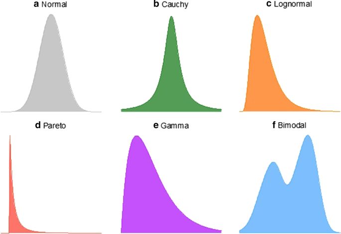
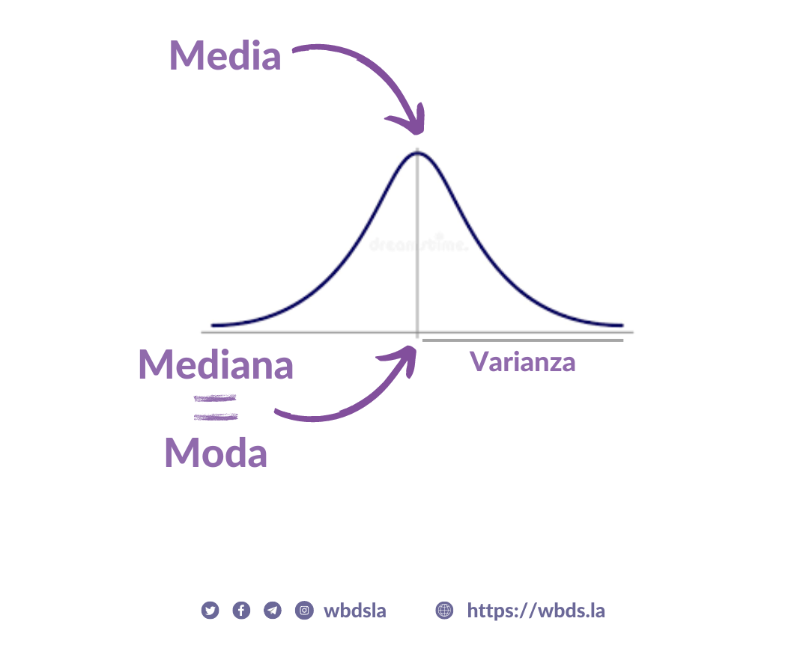
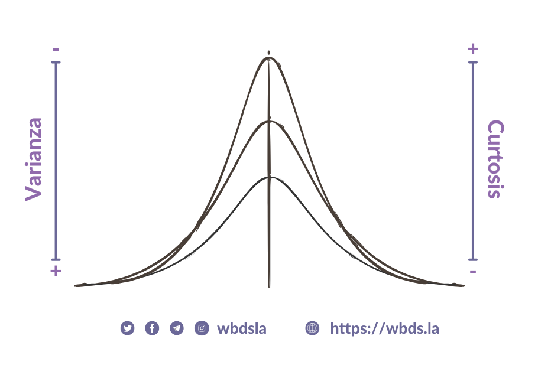

# Estadística Básica
> Material creado por la Dra. Ana Julia Velez Rueda
>
>
> **LICENSE**: This work is licensed under a
[Creative Commons Attribution-ShareAlike 4.0 International License][cc-by-sa].
>
>[![CC BY-SA 4.0][cc-by-sa-image]][cc-by-sa]

[cc-by-sa]: http://creativecommons.org/licenses/by-sa/4.0/
[cc-by-sa-image]: https://licensebuttons.net/l/by-sa/4.0/88x31.png
[cc-by-sa-shield]: https://img.shields.io/badge/License-CC%20BY--SA%204.0-lightgrey.svg

### Indice
  #### [1. ¿Qué es la estadística?](#intro)
  #### [2. Muestra vs Población](#muestra)
  #### [3. Distribuciones](#distribuciones)
  #### [4. La normalidad no existe](#normalidad)
  #### [5. Anormales 🧟‍♀️🧟‍♂️](#normalidad)
  #### [6. De variables y otros cuentos](#variables)

### [1. ¿Qué es la estadística?](#indice)

El ser humano al igual que [otras especies](https://pubmed.ncbi.nlm.nih.gov/35695157/) es capaz de reconocer [patrones](https://pubmed.ncbi.nlm.nih.gov/7488849/) y obtener información del mundo que lo rodea. La interpretación de aquellas observaciones no siempre ha sido la más cercana a la realidad, pero nos hemos encargado de ajustar nuestras observaciones, análisis e interpretaciones para lograr una mejor previsibilidad en los eventos que ocurren a nuestro alrededor. Es allí que la estadística nos brinda la metodología adecuada para recolectar, analizar, interpretar y sacar conclusiones de la información que recolectamos de los distintos eventos observados.

Además nos proporciona métodos para entre otras cosas:

1. Diseño: Planificación y realización de estudios de investigación.
2. Descripción: Resumir y explorar datos.
3. Inferencia: hacer predicciones y generalizar sobre los fenómenos representados por los datos.

### [2. Muestra vs Población](#muestra)

Ahora bien, cuando se recopilan datos para hacer observaciones sobre el mundo, por lo general no es posible recopilar **TODOS** los datos disponibles...  Por ejemplo, si quisieramos saber cuál es la altura más frecuente de un ser Humano a las distintas edades, quizás pueda resultar un poco tedioso medir la altura de todos los individuos que habitan el planeta tierra. Entonces, en lugar de preguntar a cada persona del mundo cuál es su altura y edad, puede que nos resulte más conveniente tomar una `muestra` de la `población` mundíal y luego usarla para hacer inferencias el comportamiento de la `población`.

`Población` y `muestra` son dos conceptos básicos de la estadística. La **`población`** se puede definir como el conjunto de personas, el universo de observaciones posibles u objetos en los se enfoca una investigación. Mientras que, **`muestra`** se denomina al **subconjunto** de individuos, objetos o eventos efectivamente estudiados de esa población. 

### [3. Distribuciones](#distribuciones)

Resulta que podemos aprender mucho sobre cómo ocurre algo, incluso si no conocemos el proceso subyacente que lo causa. Por ejemplo, observar qué valores son comunes (frecuentes) y cuáles poco comunes, y hacer predicciones sobre los valores que tomará tal o cual variable (característica), aún cuando no sepamos por qué. 

Es decir que un fenómeno observado a través de sus datos, podría ser expresado en función no solo de los posibles valores que puede tomar cada variable, si no también de la frecuencia con que estas toman dichos valores. A la función matemática que describe los posibles valores para una variable y la frecuencia con que estos ocurren se la conoce como **`dístribución`**.

📊 Se suele representar gráficamente la distribución las variables que caracterizan a una muestra con un gráico que describe la probabilidad de ocurrencia de cada evento (frecuencia). Pero es importante comprender que la distribución está definida por las probabilidades subyacentes y no por el gráfico en sí. El gráfico es solo una representación visual que nos facilitará el análisis.

Hay muchos tipos distintos de distribuciones estadísticas.  Conocer las características de estas distribuciones, nos permitirá caracterizar aquel conjunto de datos que se comporten de manera similar, además de comparar conjuntos de datos de interés. En general las características de una muestra puede resumirse mediante parámetros numéricos que pueden ser inferidos gracias a la estadística. Algunos de estos parámetros seguramente te resulten conocidos, como la `media` (o promedio) o la `mediana`, y los revisaremos más en detalle cuando sea necesario. Pero es importante comprender que son estos parámetros los que nos ayudarán a caracterizar nuestras datos y compararlos con otro conjunto de datos.

### [3. La normalidad no existe](#normalidad)

En ciencia nos resulta de gran utilidad contar con sistemas de referencia, de los que tenemos absoluto conocimiento de su funcionamiento para poder contrastar con aquellos completamente nuevo y desconocido. Y esto se relaciona con la forma en la que conocemos y aprendemos los seres humanos... según algunos teóricxs, que plantean que no podemos conocer aquello para de lo que no tenemos una idea previa, porque no tenemos una estructura previa con la cuál establecer relaciones. Algo así como la razón por la que pensamos la vida extraterrestre como seres antropomórficos con cabezas y cerebros grandes 👽, porque sabemos que existe una relación entre el tamaño del cerebro y la inteligencia... y porque creemos que los seres Humanos somos los mejores 😜 

Y así como buscamos vidas similares a las que conocemos en otros rincones del universo, también recurrimos a distribuciones teóricas, con parámetros predecibles o esperables, para comparar y comprender como se comportan conjunto de datos desconocidos. La distribución normal es una distribución teórica por demás utilizada en estadística. ¿Qué quiere decir que sea un distribución teórica? simplemente que su distribución de frecuencias deriva de una fórmula en lugar de provenir de observaciones reales.

La asunción de la normalidad es importante para muchas pruebas estadísticas. Si la forma de la distribución de una muestra no tiene la forma típica de campana de la distribución normal, es posible que algunas pruebas estadísticas no sean válidas para anlizar ese conjunto de datos. Pero a pesar de que la distribución normal es teórica, las distribuciones de muchos datos provenientes del mundo real se parecen a la distribución normal. Y es por ello que conocer las características de la misma, nos servirá para inferir si nuestros datos se comportan o no de forma "normal".

La distribución normal es el un tipo de distribución con simetría central, esto quiere decir que la frecuencia de los datos aumenta hacia un valor en medio del gráfico:

Ese valor central se conoce como `media` o promedio aritmético de los valores (es decir la suma de los valores dividido el número total de valores). Este parámetro es una medida de centralidad. En una districbución normal la `media` coincide con otros parámetros: la `mediana` (el valor por encima y por debajo del cual se encuentran la mitad de los eventos) y la `moda` (el de mayor frecuencia)... Es decir que en una distribución normal, el valor más frecuente es justamente el valor promedio. 

Ahora bien, el valor más frecuente no es el único posible no. Una variable podría tomar a priori infinitos valores... ¿cuántos? ¿Muy distintos del más común o frecuente? Bueno, para responder esta pregunta podemos ver cuánto se dispersan los valores respecto del eje central (`media`), es decir ver cuán lejos llegan... Esta medida se conoce como `varianza`. En algunas distribuciones, los valores están más dispersos que en otras, dando como resultado curvas más aplanadas o más esbeltas

Este achatamiento o aplanamiento de la distribución se conoce como `curtosis` y como verás está muy relacionado con la disperción de los datos.

Ahora que ya sabemos como se comporta una distribución normal, charlemos de lo importante: ¡La normalidad no existe!... digo, ¡no es lo único que existe! 😜

  
  Para pensar más allá de la estadística 🤔 

Es común escuchar **"la ciencia afirma qué"**, pero no resulta tan común escuchar explicaciones sobre cómo afirma la ciencia. 
¿Qué hace a un conocimiento `científico`? ¿Alguna vez te pusiste a pensar cómo conocemos y qué es el conocimiento? La filosofía de la ciencia se enfoca particularmente en esta pregunta. 

Aquí te dejamos algunos videos para comenzar a pensar juntxs los alcances e implicancias de cómo conocemos y cómo es que afirmamos en ciencia.. de datos 😜 

 - [El conocimiento - Mentira la Verdad](https://www.youtube.com/watch?v=v-Z9eMt-8UU&t=581s)
 - [Los patovicas de la ciencia](https://www.youtube.com/watch?v=ZMUjO5N9BCo) 

#### [5. Anormales 🧟‍♀️🧟‍♂️](#normalidad)

Algo que no dijimos hasta acá pero se nota a primera vista es que la distribución `normal` es **simétrica**. Pero como ya podés imaginar, no todas las distribuciones tienen una distribución central... estas distribuciones `"anormales"` se las conoce como `asimétricas` o `no paramétricas`. 

Como te imaginarás hay comportamientos de los parámetros que van a cambiar 😮...  ¡Si! En estos casos la `media`, `moda` y `mediana` difieren entre sí. 

>
> 🧗🏻‍♀️ DESAFÍO I: Nos pidieron analizar la distribución de los pesos de la población de ranas calvas de Marte. Según el relevamiento de la última sonda enviada por Elías Máscara el gráfico de la frecuencia de pesos de estos simpáticos animalitos sería la siguiente:
>

| Parámetro | Valor|
| -----------| -------------|
| Total de ranas medidas | 500.000|
| Media   |  5.033|
| Mediana   |    5.031|

>
> ¿Qué distribución sigue esta variable? ¿Cómo te diste cuenta?
>

#### [6. De variables y otros cuentos](#variables)

Cuando recolectamos datos acerca de un determinado fenómeno, en general tomamos información de distintas características que describen el  fenómeno en sí. Estas características es lo que se considera una `variable`. Como es de esperar por la diversidad de características distintas que pueden describir a un individuo, objeto, etc., no existe un único tipo de variable. 

Existen las que se conocen como **`variables cuantitativas o numéricas`**, que como su nombre lo dice toman valores numéricos. Estas pueden ser:
  - Discretas: que pueden tomar un número contable/finito de valores. Por ejemplo, los resultados de arrojar un dado.

  - Continuas: que pueden tomar un valor fijo dentro de un intervalo determinado. Por ejemplo, los pesos de las ranas calvas de marte 🐸😜

Pero también existe un tipo de variable no numérica o **`cualitativa`**, que como su nombre lo dice da cuenta de una característica o tributo que puede ser descripto en palabras o `"etiquetas"`. Estas a su vez pueden ser:

    - Categóricas: aquellas que se refieren a características o atributos que presenta una observación. Por ejemplo, el listado de las provincias argentinas (Buenos Aires, Córdoba, Santa Fe, etc.)

    - Ordinales: Son aquellas que sí pueden ordenarse en una jerarquía específica. Por ejemplo, los resultados de una encuesta de satisfacción con cierto servicio prestado a clientes (muy insatisfecho, insatisfecho, neutral, satisfecho, muy satisfecho).

Es fundamental distinguir los tipos de variables que existen, ya que tienen gran influencia durante el análisis y nos condicionan durante el tratamiento de los datos. 

Pero como mejor que decir es hacer, ahora que conocemos un poco más sobre distribuciones y estadística, vamos a comenzar con los contenidos específicos de [**Análisis Datos**](https://github.com/AJVelezRueda/Fundamentos_de_informatica/blob/master/Ciencia_de_datos/Analisis_datos_con_pandas.md).
