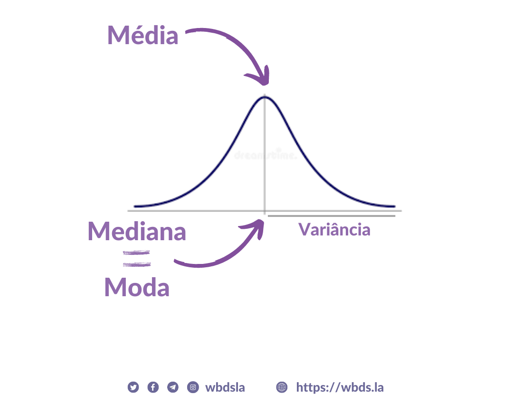
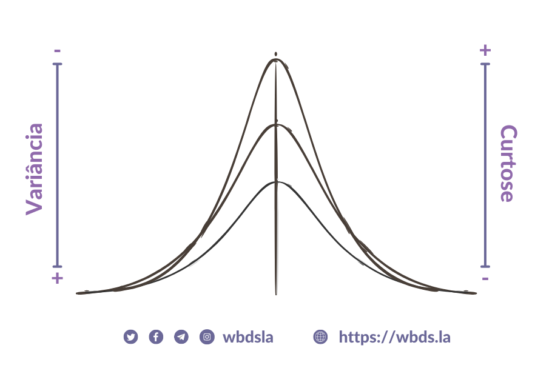
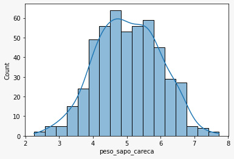

# Estatística básica
> Material elaborado pela Dra. Ana Julia Velez Rueda
>
>
> **LICENSE**: This work is licensed under a
[Creative Commons Attribution-ShareAlike 4.0 International License][cc-by-sa].
>
>[![CC BY-SA 4.0][cc-by-sa-image]][cc-by-sa]

[cc-by-sa]: http://creativecommons.org/licenses/by-sa/4.0/
[cc-by-sa-image]: https://licensebuttons.net/l/by-sa/4.0/88x31.png
[cc-by-sa-shield]: https://img.shields.io/badge/License-CC%20BY--SA%204.0-lightgrey.svg

### Índice
   #### [1. O que é estatística?](#index)
   #### [2. Amostra x População](#amostra)
   #### [3. Distribuições](#distribuições)
   #### [4. Normalidade não existe](#normalidade)
   #### [5. Anormal 🧟‍♀️🧟‍♂️](#normalidade)
   #### [6. De variáveis e outras histórias](#variáveis)

### [1. O que é estatística?](#index)

Os seres humanos, assim como [outras espécies](https://pubmed.ncbi.nlm.nih.gov/35695157/) são capazes de reconhecer [padrões](https://pubmed.ncbi.nlm.nih.gov/7488849/ ) e obter informações sobre o mundo ao seu redor. A interpretação dessas observações nem sempre é a mais próxima da realidade, mas assumimos a responsabilidade de ajustar nossas observações, análises e interpretações para obter melhor previsibilidade nos eventos que ocorrem ao nosso redor. É aí que a estatística nos fornece a metodologia adequada para coletar, analisar, interpretar e tirar conclusões a partir da informação que recolhemos a partir dos diferentes eventos observados.

Ela também nos fornece métodos para, entre outras coisas:

1. Desenho experimental: Planejamento e realização de estudos de pesquisa.
2. Descrição: Resumir e explorar dados.
3. Inferência: fazer previsões e generalizar sobre os fenômenos representados pelos dados.

### [2. Amostra x População](#amostra)

Agora, quando queremos coletar dados para fazer observações sobre o mundo, geralmente não é possível coletar **TODOS** os dados disponíveis... Por exemplo, se quisermos saber qual é a altura mais frequente de um ser humano em idades diferentes, pode ser um pouco tedioso medir a altura de todos os indivíduos que habitam o planeta Terra. Portanto, em vez de perguntar a cada pessoa no mundo qual é sua altura e idade, podemos achar mais conveniente pegar uma `amostra` da `população` do mundo e usá-la para fazer inferências sobre o comportamento da `população`.

`População` e `amostra` são dois conceitos básicos de estatística. A **`população`** pode ser definida como o conjunto de pessoas, o universo de possíveis observações ou objetos sobre os quais se concentra um estudo. Considere que, **`amostra`** é como chamamos um **subconjunto** de indivíduos, objetos ou eventos efetivamente estudados daquela população.

### [3. Distribuições](#distribuições)

Podemos aprender muito sobre como algo acontece, mesmo que não conheçamos o processo subjacente que o causa. Por exemplo, podemos observar quais valores são comuns (frequentes) e quais são incomuns, e fazer previsões sobre os valores que esta ou aquela variável (característica) assumirá, mesmo quando não sabemos o porquê.

Em outras palavras, um fenômeno observado por meio de seus dados poderia ser expresso com base não apenas nos possíveis valores que cada variável pode assumir, mas também na frequência com que elas assumem esses valores. A função matemática que descreve os valores possíveis para uma variável e a frequência com que eles ocorrem é conhecida como **`distribuição`**.

📊 A distribuição das variáveis que caracterizam uma amostra costuma ser representada graficamente, ou seja, com um gráfico que descreve a probabilidade de ocorrência de cada evento (frequência). Mas é importante entender que a distribuição é definida pelas probabilidades subjacentes e não pelo próprio gráfico. O gráfico é apenas uma representação visual que facilitará nossa análise.

Existem muitos tipos diferentes de distribuições estatísticas. Conhecer as características dessas distribuições nos permitirá caracterizar aquele conjunto de dados que se comporta de maneira semelhante, além de comparar conjuntos de dados de interesse. Em geral, as características de uma amostra podem ser resumidas por meio de parâmetros numéricos que podem ser inferidos por meio de estatísticas. Alguns desses parâmetros provavelmente são familiares para você, como a `mean` (ou média) ou a `mediana`, e iremos analisá-los com mais detalhes quando necessário. Mas é importante entender que são esses parâmetros que nos ajudarão a caracterizar nossos dados e compará-los com outro conjunto de dados.

### [3. Normalidade não existe](#normalidade)

Na ciência, é muito útil para nós termos sistemas de referência, dos quais temos conhecimento absoluto de seu funcionamento para poder compará-los com aqueles que são completamente novos e desconhecidos. E isso está relacionado com a forma como nós, seres humanos, conhecemos e aprendemos... estabelecemos relações. Algo como a razão pela qual pensamos na vida extraterrestre como seres antropomórficos com cabeças e cérebros grandes 👽, porque sabemos que existe uma relação entre o tamanho do cérebro e a inteligência... e porque acreditamos que os seres humanos são os melhores 😜.

E assim como procuramos vidas semelhantes às que conhecemos em outros cantos do universo, também nos voltamos para distribuições teóricas, com parâmetros previsíveis ou esperados, para comparar e entender como conjuntos de dados desconhecidos se comportam. A distribuição normal é uma distribuição teórica usada em estatística. O que significa ser uma distribuição teórica? Significa, simplesmente, que sua distribuição de frequência é derivada de uma fórmula e não de observações reais.

A suposição de normalidade é importante para muitos testes estatísticos. Se a forma da distribuição de uma amostra não tiver a forma de sino típica da distribuição normal, alguns testes estatísticos podem não ser válidos para analisar esse conjunto de dados. Mas, embora a distribuição normal seja teórica, as distribuições de muitos dados do mundo real se assemelham à distribuição normal. E é por isso que conhecer suas características nos ajudará a inferir se nossos dados se comportam ou não de maneira "normal".

A distribuição normal é o único tipo de distribuição com simetria central, isso significa que a frequência dos dados aumenta em direção a um valor no meio do gráfico:

Esse valor central é conhecido como `mean` ou média aritmética dos valores (ou seja, a soma dos valores dividida pelo número total de valores). Este parâmetro é uma medida de centralidade. Em uma distribuição normal, a `média` coincide com outros parâmetros: a `mediana` (o valor acima e abaixo da metade dos eventos) e a `moda` (o valor com maior frequência)... Em uma distribuição normal, o valor mais frequente é justamente o valor médio.

Agora, o valor mais frequente não é o único possível, não. Uma variável pode assumir valores infinitos a priori... Mas quantos? Muito diferente do mais comum ou frequente? Bom, para responder a essa pergunta podemos ver o quanto os valores estão dispersos em relação ao eixo central (`média`), ou seja, ver até onde eles vão... Essa medida é conhecida como `variância`. Em algumas distribuições, os valores são mais dispersos do que em outras, resultando em curvas mais planas ou esbeltas.

Esse achatamento ou rebaixamento da distribuição é conhecido como `curtose` e, como você verá, está intimamente relacionado à dispersão dos dados.

Agora que sabemos como se comporta uma distribuição normal, vamos falar do importante: Normalidade não existe!... quer dizer, não é só ela que existe! 😜

   
 Para pensar além das estatísticas 🤔 

É comum ouvir **"a ciência afirma que ..."**, mas não é tão comum ouvir explicações sobre como a ciência afirma as coisas.
O que torna um conhecimento `científico`? Você já pensou em como sabemos e o que é conhecimento? A filosofia da ciência se concentra particularmente nessa questão.

Aqui deixamos alguns vídeos para começarmos a pensar em conjunto sobre o alcance e as implicações de como sabemos e como afirmamos em ciência de dados... 😜

  - [El conocimiento - Mentira la Verdad](https://www.youtube.com/watch?v=v-Z9eMt-8UU&t=581s)
  - [Los patovicas de la ciencia](https://www.youtube.com/watch?v=ZMUjO5N9BCo)

#### [5. Anormais 🧟‍♀️🧟‍♂️](#normalidade)

Algo que não dissemos até aqui mas que se nota à primeira vista é que a distribuição `normal` é **simétrica**. Mas como você já pode imaginar, nem todas as distribuições têm uma distribuição central... essas distribuições `"anormais"` são conhecidas como `assimétricas` ou `não-paramétricas`.

Como você pode imaginar, existem comportamentos dos parâmetros que vão mudar 😮... Sim! Nestes casos, a `média`, `moda` e `mediana` diferem entre si.

>
> 🧗🏻‍♀️ DESAFIO I: Nos pediram para analisar a distribuição de peso da população de sapos carecas em Marte. Segundo o levantamento da última sonda enviada por Elías Máscara, o gráfico da frequência de pesos desses bichinhos fofos seria o seguinte:
>

| Parâmetro | Valor|
| -----------| -------------|
| Total de rãs analisadas | 500.000|
| Média | 5.033|
| Mediana | 5.031|

>
> Que distribuição segue esta variável? Como você percebeu isso?
>

#### [6. De variáveis e outras histórias](#variáveis)

Quando coletamos dados sobre um determinado fenômeno, em geral, retiramos informações de diferentes características que descrevem o próprio fenômeno. Essas características são o que se considera uma `variável`. Como esperado pela diversidade de diferentes características que podem descrever um indivíduo, objeto, etc., não existe um único tipo de variável.

Existem aquelas conhecidas como **`variáveis quantitativas ou numéricas`**, que, como o próprio nome diz, assumem valores numéricos. Que podem ser:
   - Discretos: pode assumir um número contável/finito de valores. Por exemplo, os resultados do lançamento de um dado.

   - Contínuos: que pode assumir um valor fixo dentro de um determinado intervalo. Por exemplo, os pesos dos sapos carecas em Marte 🐸😜

Mas há também um tipo de variável não numérica ou **`qualitativa`**, que, como o próprio nome diz, dá conta de uma característica ou tributo que pode ser descrito em palavras ou `"rótulos"`. Estes, por sua vez, podem ser:

     - Categóricas: aquelas que se referem às características ou atributos que uma observação apresenta. Por exemplo, a lista de províncias argentinas (Buenos Aires, Córdoba, Santa Fe, etc.)

     - Ordinais: São aquelas que podem ser ordenadas em uma hierarquia específica. Por exemplo, os resultados de uma pesquisa de satisfação com determinado serviço prestado aos clientes (muito insatisfeito, insatisfeito, neutro, satisfeito, muito satisfeito).

É essencial distinguir os tipos de variáveis existentes, pois elas têm grande influência durante a análise e nos condicionam durante o tratamento dos dados.

Mas como melhor do que dizer é fazer, agora que já sabemos um pouco mais sobre distribuições e estatísticas, vamos partir do conteúdo específico de [**Análises de Datos**](https://github.com/AJVelezRueda/Fundamentos_de_informatica/blob/master/Data_Science/Data_analysis_with_pandas.md).
